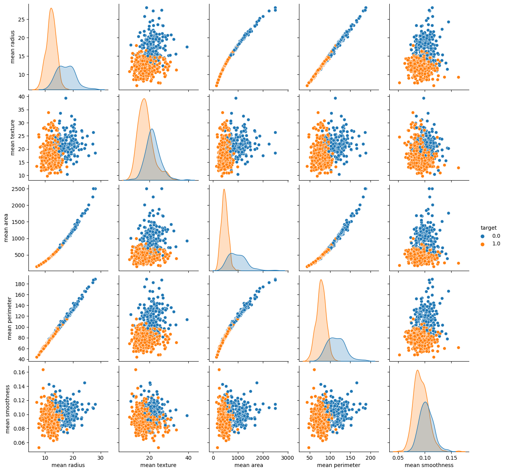
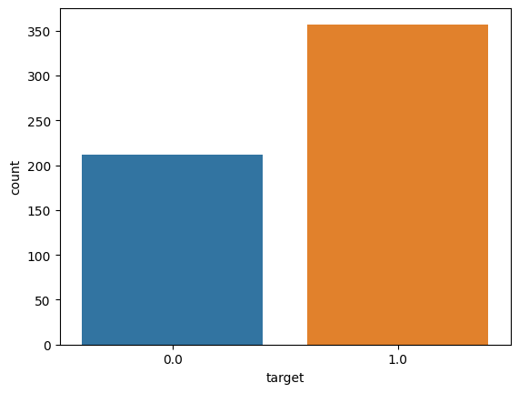
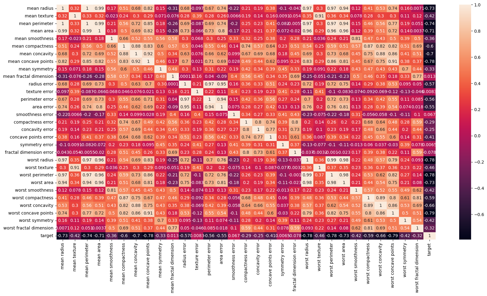
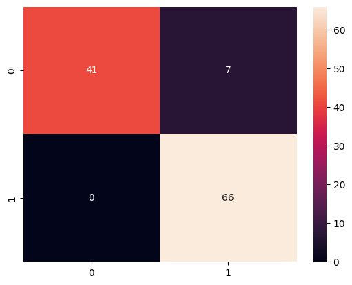
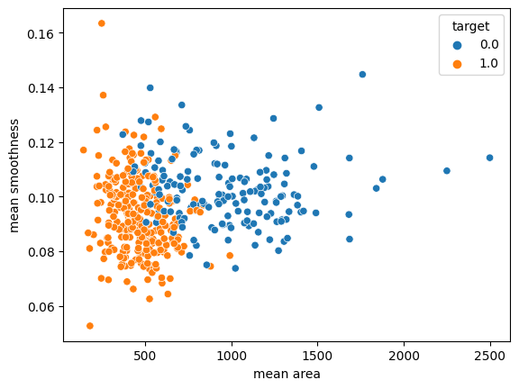
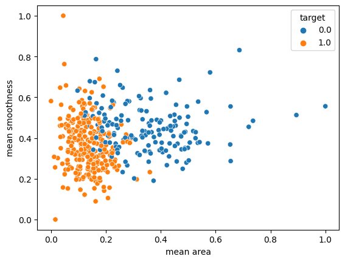
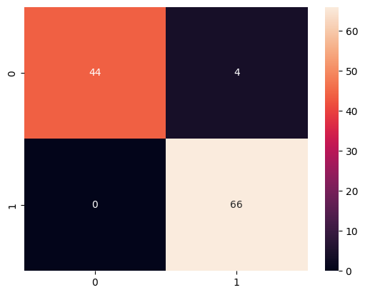

# Breast Cancer Classification


Adil Said

**Problem Statement**

- Predicting if the cancer diagnosis is benign or malignant based on several observations/features 
- 30 features are used, examples:
    - radius (mean of distances from center to points on the perimeter)
    - texture (standard deviation of gray-scale values)
    - perimeter
    - area
    - smoothness (local variation in radius lengths)
    - compactness (perimeter^2 / area - 1.0)
    - concavity (severity of concave portions of the contour)
    - concave points (number of concave portions of the contour)
    - symmetry 
    - fractal dimension ("coastline approximation" - 1)

- Datasets are linearly separable using all 30 input features
- Number of Instances: 569
- Class Distribution: 212 Malignant, 357 Benign
- Target class:
     - Malignant
     - Benign


https://archive.ics.uci.edu/ml/datasets/Breast+Cancer+Wisconsin+(Diagnostic)

## Import Data


```python
import pandas as pd
import numpy as np
import matplotlib.pyplot as plt
import seaborn as sns
```


```python
# Loading Cancer data
from sklearn.datasets import load_breast_cancer
cancer = load_breast_cancer()
```


```python
cancer.keys()
```


    dict_keys(['data', 'target', 'frame', 'target_names', 'DESCR', 'feature_names', 'filename', 'data_module'])


**Getting some description of the data**


```python
print(cancer["DESCR"])
```

    .. _breast_cancer_dataset:
    
    Breast cancer wisconsin (diagnostic) dataset
    --------------------------------------------
    
    **Data Set Characteristics:**
    
        :Number of Instances: 569
    
        :Number of Attributes: 30 numeric, predictive attributes and the class
    
        :Attribute Information:
            - radius (mean of distances from center to points on the perimeter)
            - texture (standard deviation of gray-scale values)
            - perimeter
            - area
            - smoothness (local variation in radius lengths)
            - compactness (perimeter^2 / area - 1.0)
            - concavity (severity of concave portions of the contour)
            - concave points (number of concave portions of the contour)
            - symmetry
            - fractal dimension ("coastline approximation" - 1)
    
            The mean, standard error, and "worst" or largest (mean of the three
            worst/largest values) of these features were computed for each image,
            resulting in 30 features.  For instance, field 0 is Mean Radius, field
            10 is Radius SE, field 20 is Worst Radius.
    
            - class:
                    - WDBC-Malignant
                    - WDBC-Benign
    
        :Summary Statistics:
    
        ===================================== ====== ======
                                               Min    Max
        ===================================== ====== ======
        radius (mean):                        6.981  28.11
        texture (mean):                       9.71   39.28
        perimeter (mean):                     43.79  188.5
        area (mean):                          143.5  2501.0
        smoothness (mean):                    0.053  0.163
        compactness (mean):                   0.019  0.345
        concavity (mean):                     0.0    0.427
        concave points (mean):                0.0    0.201
        symmetry (mean):                      0.106  0.304
        fractal dimension (mean):             0.05   0.097
        radius (standard error):              0.112  2.873
        texture (standard error):             0.36   4.885
        perimeter (standard error):           0.757  21.98
        area (standard error):                6.802  542.2
        smoothness (standard error):          0.002  0.031
        compactness (standard error):         0.002  0.135
        concavity (standard error):           0.0    0.396
        concave points (standard error):      0.0    0.053
        symmetry (standard error):            0.008  0.079
        fractal dimension (standard error):   0.001  0.03
        radius (worst):                       7.93   36.04
        texture (worst):                      12.02  49.54
        perimeter (worst):                    50.41  251.2
        area (worst):                         185.2  4254.0
        smoothness (worst):                   0.071  0.223
        compactness (worst):                  0.027  1.058
        concavity (worst):                    0.0    1.252
        concave points (worst):               0.0    0.291
        symmetry (worst):                     0.156  0.664
        fractal dimension (worst):            0.055  0.208
        ===================================== ====== ======
    
        :Missing Attribute Values: None
    
        :Class Distribution: 212 - Malignant, 357 - Benign
    
        :Creator:  Dr. William H. Wolberg, W. Nick Street, Olvi L. Mangasarian
    
        :Donor: Nick Street
    
        :Date: November, 1995
    
    This is a copy of UCI ML Breast Cancer Wisconsin (Diagnostic) datasets.
    https://goo.gl/U2Uwz2
    
    Features are computed from a digitized image of a fine needle
    aspirate (FNA) of a breast mass.  They describe
    characteristics of the cell nuclei present in the image.
    
    Separating plane described above was obtained using
    Multisurface Method-Tree (MSM-T) [K. P. Bennett, "Decision Tree
    Construction Via Linear Programming." Proceedings of the 4th
    Midwest Artificial Intelligence and Cognitive Science Society,
    pp. 97-101, 1992], a classification method which uses linear
    programming to construct a decision tree.  Relevant features
    were selected using an exhaustive search in the space of 1-4
    features and 1-3 separating planes.
    
    The actual linear program used to obtain the separating plane
    in the 3-dimensional space is that described in:
    [K. P. Bennett and O. L. Mangasarian: "Robust Linear
    Programming Discrimination of Two Linearly Inseparable Sets",
    Optimization Methods and Software 1, 1992, 23-34].
    
    This database is also available through the UW CS ftp server:
    
    ftp ftp.cs.wisc.edu
    cd math-prog/cpo-dataset/machine-learn/WDBC/
    
    .. topic:: References
    
       - W.N. Street, W.H. Wolberg and O.L. Mangasarian. Nuclear feature extraction 
         for breast tumor diagnosis. IS&T/SPIE 1993 International Symposium on 
         Electronic Imaging: Science and Technology, volume 1905, pages 861-870,
         San Jose, CA, 1993.
       - O.L. Mangasarian, W.N. Street and W.H. Wolberg. Breast cancer diagnosis and 
         prognosis via linear programming. Operations Research, 43(4), pages 570-577, 
         July-August 1995.
       - W.H. Wolberg, W.N. Street, and O.L. Mangasarian. Machine learning techniques
         to diagnose breast cancer from fine-needle aspirates. Cancer Letters 77 (1994) 
         163-171.


```python
cancer["data"].shape
```


    (569, 30)


**The data has 569 rows and 30 features**

**Next I convert this data into a pandas dataframe**


```python
df = pd.DataFrame(np.c_[cancer["data"], cancer["target"]], columns = np.append(cancer["feature_names"], ["target"]))
df.head()
```


<div>
<style scoped>
    .dataframe tbody tr th:only-of-type {
        vertical-align: middle;
    }

    .dataframe tbody tr th {
        vertical-align: top;
    }

    .dataframe thead th {
        text-align: right;
    }
</style>
<table border="1" class="dataframe">
  <thead>
    <tr style="text-align: right;">
      <th></th>
      <th>mean radius</th>
      <th>mean texture</th>
      <th>mean perimeter</th>
      <th>mean area</th>
      <th>mean smoothness</th>
      <th>mean compactness</th>
      <th>mean concavity</th>
      <th>mean concave points</th>
      <th>mean symmetry</th>
      <th>mean fractal dimension</th>
      <th>...</th>
      <th>worst texture</th>
      <th>worst perimeter</th>
      <th>worst area</th>
      <th>worst smoothness</th>
      <th>worst compactness</th>
      <th>worst concavity</th>
      <th>worst concave points</th>
      <th>worst symmetry</th>
      <th>worst fractal dimension</th>
      <th>target</th>
    </tr>
  </thead>
  <tbody>
    <tr>
      <th>0</th>
      <td>17.99</td>
      <td>10.38</td>
      <td>122.80</td>
      <td>1001.0</td>
      <td>0.11840</td>
      <td>0.27760</td>
      <td>0.3001</td>
      <td>0.14710</td>
      <td>0.2419</td>
      <td>0.07871</td>
      <td>...</td>
      <td>17.33</td>
      <td>184.60</td>
      <td>2019.0</td>
      <td>0.1622</td>
      <td>0.6656</td>
      <td>0.7119</td>
      <td>0.2654</td>
      <td>0.4601</td>
      <td>0.11890</td>
      <td>0.0</td>
    </tr>
    <tr>
      <th>1</th>
      <td>20.57</td>
      <td>17.77</td>
      <td>132.90</td>
      <td>1326.0</td>
      <td>0.08474</td>
      <td>0.07864</td>
      <td>0.0869</td>
      <td>0.07017</td>
      <td>0.1812</td>
      <td>0.05667</td>
      <td>...</td>
      <td>23.41</td>
      <td>158.80</td>
      <td>1956.0</td>
      <td>0.1238</td>
      <td>0.1866</td>
      <td>0.2416</td>
      <td>0.1860</td>
      <td>0.2750</td>
      <td>0.08902</td>
      <td>0.0</td>
    </tr>
    <tr>
      <th>2</th>
      <td>19.69</td>
      <td>21.25</td>
      <td>130.00</td>
      <td>1203.0</td>
      <td>0.10960</td>
      <td>0.15990</td>
      <td>0.1974</td>
      <td>0.12790</td>
      <td>0.2069</td>
      <td>0.05999</td>
      <td>...</td>
      <td>25.53</td>
      <td>152.50</td>
      <td>1709.0</td>
      <td>0.1444</td>
      <td>0.4245</td>
      <td>0.4504</td>
      <td>0.2430</td>
      <td>0.3613</td>
      <td>0.08758</td>
      <td>0.0</td>
    </tr>
    <tr>
      <th>3</th>
      <td>11.42</td>
      <td>20.38</td>
      <td>77.58</td>
      <td>386.1</td>
      <td>0.14250</td>
      <td>0.28390</td>
      <td>0.2414</td>
      <td>0.10520</td>
      <td>0.2597</td>
      <td>0.09744</td>
      <td>...</td>
      <td>26.50</td>
      <td>98.87</td>
      <td>567.7</td>
      <td>0.2098</td>
      <td>0.8663</td>
      <td>0.6869</td>
      <td>0.2575</td>
      <td>0.6638</td>
      <td>0.17300</td>
      <td>0.0</td>
    </tr>
    <tr>
      <th>4</th>
      <td>20.29</td>
      <td>14.34</td>
      <td>135.10</td>
      <td>1297.0</td>
      <td>0.10030</td>
      <td>0.13280</td>
      <td>0.1980</td>
      <td>0.10430</td>
      <td>0.1809</td>
      <td>0.05883</td>
      <td>...</td>
      <td>16.67</td>
      <td>152.20</td>
      <td>1575.0</td>
      <td>0.1374</td>
      <td>0.2050</td>
      <td>0.4000</td>
      <td>0.1625</td>
      <td>0.2364</td>
      <td>0.07678</td>
      <td>0.0</td>
    </tr>
  </tbody>
</table>
<p>5 rows × 31 columns</p>
</div>


## Data Visualization


```python
sns.pairplot(df, vars=["mean radius", "mean texture", "mean area", "mean perimeter", "mean smoothness"], 
             hue = "target")
```


    <seaborn.axisgrid.PairGrid at 0x7b5ee4ab6ef0>


    

    


0 - indicates Malignant --> The life threatning case

1 - indicates Benign

**Some observation :**
- Looking at the distributions for mean radius, mean area and mean perimeter. We see that Malignant cases tend to be larger than Benign.

- Looking at mean texture, we see that Melignant have a higher mean texture compared with Benign. 

- Benign have higher mean smoothness than Melignant

**Next: Looking at some count plot**


```python
sns.countplot(x = "target", data = df)
```


    <AxesSubplot: xlabel='target', ylabel='count'>


    

    


**Some observation**:
- More Benign cases than Malignent in the dataset.


```python
df.columns
```


    Index(['mean radius', 'mean texture', 'mean perimeter', 'mean area',
           'mean smoothness', 'mean compactness', 'mean concavity',
           'mean concave points', 'mean symmetry', 'mean fractal dimension',
           'radius error', 'texture error', 'perimeter error', 'area error',
           'smoothness error', 'compactness error', 'concavity error',
           'concave points error', 'symmetry error', 'fractal dimension error',
           'worst radius', 'worst texture', 'worst perimeter', 'worst area',
           'worst smoothness', 'worst compactness', 'worst concavity',
           'worst concave points', 'worst symmetry', 'worst fractal dimension',
           'target'],
          dtype='object')


```python
plt.figure(figsize= (20,10))
sns.heatmap(df.corr(), annot = True)
```


    <AxesSubplot: >


    

    


## Model Training

- Define Matrix of Features *X* and target *y*

- Split into testing and training data


```python
# Matrix of features X and target y
X = df.drop(["target"], axis = 1)
y = df["target"]
```


```python
from sklearn.model_selection import train_test_split

X_train, X_test, y_train, y_test = train_test_split(X, y, test_size = 0.20, random_state=5)
```


```python
from sklearn.svm import SVC
from sklearn.metrics import classification_report, confusion_matrix
```


```python
model1 = SVC()

model1.fit(X_train, y_train)
```


<style>#sk-container-id-1 {color: black;background-color: white;}#sk-container-id-1 pre{padding: 0;}#sk-container-id-1 div.sk-toggleable {background-color: white;}#sk-container-id-1 label.sk-toggleable__label {cursor: pointer;display: block;width: 100%;margin-bottom: 0;padding: 0.3em;box-sizing: border-box;text-align: center;}#sk-container-id-1 label.sk-toggleable__label-arrow:before {content: "▸";float: left;margin-right: 0.25em;color: #696969;}#sk-container-id-1 label.sk-toggleable__label-arrow:hover:before {color: black;}#sk-container-id-1 div.sk-estimator:hover label.sk-toggleable__label-arrow:before {color: black;}#sk-container-id-1 div.sk-toggleable__content {max-height: 0;max-width: 0;overflow: hidden;text-align: left;background-color: #f0f8ff;}#sk-container-id-1 div.sk-toggleable__content pre {margin: 0.2em;color: black;border-radius: 0.25em;background-color: #f0f8ff;}#sk-container-id-1 input.sk-toggleable__control:checked~div.sk-toggleable__content {max-height: 200px;max-width: 100%;overflow: auto;}#sk-container-id-1 input.sk-toggleable__control:checked~label.sk-toggleable__label-arrow:before {content: "▾";}#sk-container-id-1 div.sk-estimator input.sk-toggleable__control:checked~label.sk-toggleable__label {background-color: #d4ebff;}#sk-container-id-1 div.sk-label input.sk-toggleable__control:checked~label.sk-toggleable__label {background-color: #d4ebff;}#sk-container-id-1 input.sk-hidden--visually {border: 0;clip: rect(1px 1px 1px 1px);clip: rect(1px, 1px, 1px, 1px);height: 1px;margin: -1px;overflow: hidden;padding: 0;position: absolute;width: 1px;}#sk-container-id-1 div.sk-estimator {font-family: monospace;background-color: #f0f8ff;border: 1px dotted black;border-radius: 0.25em;box-sizing: border-box;margin-bottom: 0.5em;}#sk-container-id-1 div.sk-estimator:hover {background-color: #d4ebff;}#sk-container-id-1 div.sk-parallel-item::after {content: "";width: 100%;border-bottom: 1px solid gray;flex-grow: 1;}#sk-container-id-1 div.sk-label:hover label.sk-toggleable__label {background-color: #d4ebff;}#sk-container-id-1 div.sk-serial::before {content: "";position: absolute;border-left: 1px solid gray;box-sizing: border-box;top: 0;bottom: 0;left: 50%;z-index: 0;}#sk-container-id-1 div.sk-serial {display: flex;flex-direction: column;align-items: center;background-color: white;padding-right: 0.2em;padding-left: 0.2em;position: relative;}#sk-container-id-1 div.sk-item {position: relative;z-index: 1;}#sk-container-id-1 div.sk-parallel {display: flex;align-items: stretch;justify-content: center;background-color: white;position: relative;}#sk-container-id-1 div.sk-item::before, #sk-container-id-1 div.sk-parallel-item::before {content: "";position: absolute;border-left: 1px solid gray;box-sizing: border-box;top: 0;bottom: 0;left: 50%;z-index: -1;}#sk-container-id-1 div.sk-parallel-item {display: flex;flex-direction: column;z-index: 1;position: relative;background-color: white;}#sk-container-id-1 div.sk-parallel-item:first-child::after {align-self: flex-end;width: 50%;}#sk-container-id-1 div.sk-parallel-item:last-child::after {align-self: flex-start;width: 50%;}#sk-container-id-1 div.sk-parallel-item:only-child::after {width: 0;}#sk-container-id-1 div.sk-dashed-wrapped {border: 1px dashed gray;margin: 0 0.4em 0.5em 0.4em;box-sizing: border-box;padding-bottom: 0.4em;background-color: white;}#sk-container-id-1 div.sk-label label {font-family: monospace;font-weight: bold;display: inline-block;line-height: 1.2em;}#sk-container-id-1 div.sk-label-container {text-align: center;}#sk-container-id-1 div.sk-container {/* jupyter's `normalize.less` sets `[hidden] { display: none; }` but bootstrap.min.css set `[hidden] { display: none !important; }` so we also need the `!important` here to be able to override the default hidden behavior on the sphinx rendered scikit-learn.org. See: https://github.com/scikit-learn/scikit-learn/issues/21755 */display: inline-block !important;position: relative;}#sk-container-id-1 div.sk-text-repr-fallback {display: none;}</style><div id="sk-container-id-1" class="sk-top-container"><div class="sk-text-repr-fallback"><pre>SVC()</pre><b>In a Jupyter environment, please rerun this cell to show the HTML representation or trust the notebook. <br />On GitHub, the HTML representation is unable to render, please try loading this page with nbviewer.org.</b></div><div class="sk-container" hidden><div class="sk-item"><div class="sk-estimator sk-toggleable"><input class="sk-toggleable__control sk-hidden--visually" id="sk-estimator-id-1" type="checkbox" checked><label for="sk-estimator-id-1" class="sk-toggleable__label sk-toggleable__label-arrow">SVC</label><div class="sk-toggleable__content"><pre>SVC()</pre></div></div></div></div></div>


## Model Evaluation


```python
pred = model1.predict(X_test)
pred
```


    array([0., 1., 1., 1., 1., 0., 1., 1., 1., 1., 1., 1., 0., 1., 1., 1., 1.,
           1., 1., 1., 0., 1., 1., 1., 1., 1., 1., 0., 1., 0., 0., 0., 1., 0.,
           1., 1., 0., 1., 1., 0., 1., 1., 1., 0., 1., 1., 0., 0., 1., 0., 1.,
           1., 1., 1., 1., 0., 1., 0., 1., 0., 0., 1., 1., 1., 1., 1., 1., 1.,
           1., 0., 1., 0., 1., 1., 1., 1., 1., 1., 0., 0., 0., 1., 0., 0., 0.,
           1., 0., 1., 0., 0., 0., 0., 1., 1., 0., 0., 1., 1., 1., 1., 1., 0.,
           1., 1., 0., 0., 1., 0., 1., 0., 1., 0., 1., 0.])


```python
cm = confusion_matrix(y_test, pred)
sns.heatmap(cm, annot = True)
```


    <AxesSubplot: >


    

    


**Looking at these results:**
- We have 0 type II errors. I.e, so the model did not give any False Negatives.
- 7 type I errors. The model gave 7 False Positive.
- When a cell was malignant, the model correcrly 41. And When the cell was benign, the model correcrlt identified 66.

# Improving the Model

1. Feature scaling (Uniity Based Normalization).

2.  Grid Search. SVM parameters optimization: 
    - C parameter : Controll the trade of between classyfying and having a smooth decision bounary.
        - Small C (loose) : Makes cost of misclassification low (soft margin).
        - Large C (strict) : Makes cost of misclassification high, forcing model to explain input data stricter potentially over fitting.
    - Gamma parameter : Controls how far the influence of a single training set reaches.
        - Large Gamma : Close reach (closer data points have more weight)
        
        - Small Gamna : Far reach (more generalized solution)
        


**1. Feature Scaling**


```python
min_train = X_train.min()
range_train = (X_train-min_train).max()
X_train_scaled = (X_train - min_train)/range_train
```


```python
# Non scaled plot
sns.scatterplot(x = X_train["mean area"], y = X_train["mean smoothness"], hue = y_train)
```


    <AxesSubplot: xlabel='mean area', ylabel='mean smoothness'>


    

    


```python
# scaled plot
sns.scatterplot(x = X_train_scaled["mean area"], y = X_train_scaled["mean smoothness"], hue = y_train)
```


    <AxesSubplot: xlabel='mean area', ylabel='mean smoothness'>


    

    


```python
# Scaling testing data
min_test = X_test.min()
range_test = (X_test-min_test).max()
X_test_scaled = (X_test - min_test)/range_test
```

**Train the model using the scaled data**


```python
model2 = SVC()
model2.fit(X_train_scaled, y_train)
```


<style>#sk-container-id-2 {color: black;background-color: white;}#sk-container-id-2 pre{padding: 0;}#sk-container-id-2 div.sk-toggleable {background-color: white;}#sk-container-id-2 label.sk-toggleable__label {cursor: pointer;display: block;width: 100%;margin-bottom: 0;padding: 0.3em;box-sizing: border-box;text-align: center;}#sk-container-id-2 label.sk-toggleable__label-arrow:before {content: "▸";float: left;margin-right: 0.25em;color: #696969;}#sk-container-id-2 label.sk-toggleable__label-arrow:hover:before {color: black;}#sk-container-id-2 div.sk-estimator:hover label.sk-toggleable__label-arrow:before {color: black;}#sk-container-id-2 div.sk-toggleable__content {max-height: 0;max-width: 0;overflow: hidden;text-align: left;background-color: #f0f8ff;}#sk-container-id-2 div.sk-toggleable__content pre {margin: 0.2em;color: black;border-radius: 0.25em;background-color: #f0f8ff;}#sk-container-id-2 input.sk-toggleable__control:checked~div.sk-toggleable__content {max-height: 200px;max-width: 100%;overflow: auto;}#sk-container-id-2 input.sk-toggleable__control:checked~label.sk-toggleable__label-arrow:before {content: "▾";}#sk-container-id-2 div.sk-estimator input.sk-toggleable__control:checked~label.sk-toggleable__label {background-color: #d4ebff;}#sk-container-id-2 div.sk-label input.sk-toggleable__control:checked~label.sk-toggleable__label {background-color: #d4ebff;}#sk-container-id-2 input.sk-hidden--visually {border: 0;clip: rect(1px 1px 1px 1px);clip: rect(1px, 1px, 1px, 1px);height: 1px;margin: -1px;overflow: hidden;padding: 0;position: absolute;width: 1px;}#sk-container-id-2 div.sk-estimator {font-family: monospace;background-color: #f0f8ff;border: 1px dotted black;border-radius: 0.25em;box-sizing: border-box;margin-bottom: 0.5em;}#sk-container-id-2 div.sk-estimator:hover {background-color: #d4ebff;}#sk-container-id-2 div.sk-parallel-item::after {content: "";width: 100%;border-bottom: 1px solid gray;flex-grow: 1;}#sk-container-id-2 div.sk-label:hover label.sk-toggleable__label {background-color: #d4ebff;}#sk-container-id-2 div.sk-serial::before {content: "";position: absolute;border-left: 1px solid gray;box-sizing: border-box;top: 0;bottom: 0;left: 50%;z-index: 0;}#sk-container-id-2 div.sk-serial {display: flex;flex-direction: column;align-items: center;background-color: white;padding-right: 0.2em;padding-left: 0.2em;position: relative;}#sk-container-id-2 div.sk-item {position: relative;z-index: 1;}#sk-container-id-2 div.sk-parallel {display: flex;align-items: stretch;justify-content: center;background-color: white;position: relative;}#sk-container-id-2 div.sk-item::before, #sk-container-id-2 div.sk-parallel-item::before {content: "";position: absolute;border-left: 1px solid gray;box-sizing: border-box;top: 0;bottom: 0;left: 50%;z-index: -1;}#sk-container-id-2 div.sk-parallel-item {display: flex;flex-direction: column;z-index: 1;position: relative;background-color: white;}#sk-container-id-2 div.sk-parallel-item:first-child::after {align-self: flex-end;width: 50%;}#sk-container-id-2 div.sk-parallel-item:last-child::after {align-self: flex-start;width: 50%;}#sk-container-id-2 div.sk-parallel-item:only-child::after {width: 0;}#sk-container-id-2 div.sk-dashed-wrapped {border: 1px dashed gray;margin: 0 0.4em 0.5em 0.4em;box-sizing: border-box;padding-bottom: 0.4em;background-color: white;}#sk-container-id-2 div.sk-label label {font-family: monospace;font-weight: bold;display: inline-block;line-height: 1.2em;}#sk-container-id-2 div.sk-label-container {text-align: center;}#sk-container-id-2 div.sk-container {/* jupyter's `normalize.less` sets `[hidden] { display: none; }` but bootstrap.min.css set `[hidden] { display: none !important; }` so we also need the `!important` here to be able to override the default hidden behavior on the sphinx rendered scikit-learn.org. See: https://github.com/scikit-learn/scikit-learn/issues/21755 */display: inline-block !important;position: relative;}#sk-container-id-2 div.sk-text-repr-fallback {display: none;}</style><div id="sk-container-id-2" class="sk-top-container"><div class="sk-text-repr-fallback"><pre>SVC()</pre><b>In a Jupyter environment, please rerun this cell to show the HTML representation or trust the notebook. <br />On GitHub, the HTML representation is unable to render, please try loading this page with nbviewer.org.</b></div><div class="sk-container" hidden><div class="sk-item"><div class="sk-estimator sk-toggleable"><input class="sk-toggleable__control sk-hidden--visually" id="sk-estimator-id-2" type="checkbox" checked><label for="sk-estimator-id-2" class="sk-toggleable__label sk-toggleable__label-arrow">SVC</label><div class="sk-toggleable__content"><pre>SVC()</pre></div></div></div></div></div>


**Prediction using the new model**


```python
pred2 = model2.predict(X_test_scaled)
```


```python
cm2 = confusion_matrix(y_test, pred2)
sns.heatmap(cm2, annot = True)
```


    <AxesSubplot: >


    

    


```python
print(classification_report(y_test, pred2))
```

                  precision    recall  f1-score   support
    
             0.0       1.00      0.92      0.96        48
             1.0       0.94      1.00      0.97        66
    
        accuracy                           0.96       114
       macro avg       0.97      0.96      0.96       114
    weighted avg       0.97      0.96      0.96       114
    


**Grid Search for parameter optimization**


```python
param_grid = {'C': [0.1, 1, 10, 100], 'gamma': [1, 0.1, 0.01, 0.001], 'kernel': ['rbf']} 
```


```python
from sklearn.model_selection import GridSearchCV
```


```python
grid = GridSearchCV(SVC(),param_grid,refit=True,verbose=4)
```


```python
grid.fit(X_train_scaled,y_train)
```

    Fitting 5 folds for each of 16 candidates, totalling 80 fits
    [CV 1/5] END ........C=0.1, gamma=1, kernel=rbf;, score=1.000 total time=   0.0s
    [CV 2/5] END ........C=0.1, gamma=1, kernel=rbf;, score=0.945 total time=   0.0s
    [CV 3/5] END ........C=0.1, gamma=1, kernel=rbf;, score=0.912 total time=   0.0s
    [CV 4/5] END ........C=0.1, gamma=1, kernel=rbf;, score=0.956 total time=   0.0s
    [CV 5/5] END ........C=0.1, gamma=1, kernel=rbf;, score=0.934 total time=   0.0s
    [CV 1/5] END ......C=0.1, gamma=0.1, kernel=rbf;, score=0.945 total time=   0.0s
    [CV 2/5] END ......C=0.1, gamma=0.1, kernel=rbf;, score=0.901 total time=   0.0s
    [CV 3/5] END ......C=0.1, gamma=0.1, kernel=rbf;, score=0.890 total time=   0.0s
    [CV 4/5] END ......C=0.1, gamma=0.1, kernel=rbf;, score=0.923 total time=   0.0s
    [CV 5/5] END ......C=0.1, gamma=0.1, kernel=rbf;, score=0.868 total time=   0.0s
    [CV 1/5] END .....C=0.1, gamma=0.01, kernel=rbf;, score=0.648 total time=   0.0s
    [CV 2/5] END .....C=0.1, gamma=0.01, kernel=rbf;, score=0.637 total time=   0.0s
    [CV 3/5] END .....C=0.1, gamma=0.01, kernel=rbf;, score=0.637 total time=   0.0s
    [CV 4/5] END .....C=0.1, gamma=0.01, kernel=rbf;, score=0.637 total time=   0.0s
    [CV 5/5] END .....C=0.1, gamma=0.01, kernel=rbf;, score=0.637 total time=   0.0s
    [CV 1/5] END ....C=0.1, gamma=0.001, kernel=rbf;, score=0.648 total time=   0.0s
    [CV 2/5] END ....C=0.1, gamma=0.001, kernel=rbf;, score=0.637 total time=   0.0s
    [CV 3/5] END ....C=0.1, gamma=0.001, kernel=rbf;, score=0.637 total time=   0.0s
    [CV 4/5] END ....C=0.1, gamma=0.001, kernel=rbf;, score=0.637 total time=   0.0s
    [CV 5/5] END ....C=0.1, gamma=0.001, kernel=rbf;, score=0.637 total time=   0.0s
    [CV 1/5] END ..........C=1, gamma=1, kernel=rbf;, score=1.000 total time=   0.0s
    [CV 2/5] END ..........C=1, gamma=1, kernel=rbf;, score=0.956 total time=   0.0s
    [CV 3/5] END ..........C=1, gamma=1, kernel=rbf;, score=0.967 total time=   0.0s
    [CV 4/5] END ..........C=1, gamma=1, kernel=rbf;, score=1.000 total time=   0.0s
    [CV 5/5] END ..........C=1, gamma=1, kernel=rbf;, score=0.967 total time=   0.0s
    [CV 1/5] END ........C=1, gamma=0.1, kernel=rbf;, score=0.989 total time=   0.0s
    [CV 2/5] END ........C=1, gamma=0.1, kernel=rbf;, score=0.945 total time=   0.0s
    [CV 3/5] END ........C=1, gamma=0.1, kernel=rbf;, score=0.923 total time=   0.0s
    [CV 4/5] END ........C=1, gamma=0.1, kernel=rbf;, score=0.967 total time=   0.0s
    [CV 5/5] END ........C=1, gamma=0.1, kernel=rbf;, score=0.934 total time=   0.0s
    [CV 1/5] END .......C=1, gamma=0.01, kernel=rbf;, score=0.945 total time=   0.0s
    [CV 2/5] END .......C=1, gamma=0.01, kernel=rbf;, score=0.901 total time=   0.0s
    [CV 3/5] END .......C=1, gamma=0.01, kernel=rbf;, score=0.879 total time=   0.0s
    [CV 4/5] END .......C=1, gamma=0.01, kernel=rbf;, score=0.923 total time=   0.0s
    [CV 5/5] END .......C=1, gamma=0.01, kernel=rbf;, score=0.868 total time=   0.0s
    [CV 1/5] END ......C=1, gamma=0.001, kernel=rbf;, score=0.648 total time=   0.0s
    [CV 2/5] END ......C=1, gamma=0.001, kernel=rbf;, score=0.637 total time=   0.0s
    [CV 3/5] END ......C=1, gamma=0.001, kernel=rbf;, score=0.637 total time=   0.0s
    [CV 4/5] END ......C=1, gamma=0.001, kernel=rbf;, score=0.637 total time=   0.0s
    [CV 5/5] END ......C=1, gamma=0.001, kernel=rbf;, score=0.637 total time=   0.0s
    [CV 1/5] END .........C=10, gamma=1, kernel=rbf;, score=1.000 total time=   0.0s
    [CV 2/5] END .........C=10, gamma=1, kernel=rbf;, score=0.967 total time=   0.0s
    [CV 3/5] END .........C=10, gamma=1, kernel=rbf;, score=0.956 total time=   0.0s
    [CV 4/5] END .........C=10, gamma=1, kernel=rbf;, score=1.000 total time=   0.0s
    [CV 5/5] END .........C=10, gamma=1, kernel=rbf;, score=0.956 total time=   0.0s
    [CV 1/5] END .......C=10, gamma=0.1, kernel=rbf;, score=1.000 total time=   0.0s
    [CV 2/5] END .......C=10, gamma=0.1, kernel=rbf;, score=0.967 total time=   0.0s
    [CV 3/5] END .......C=10, gamma=0.1, kernel=rbf;, score=0.967 total time=   0.0s
    [CV 4/5] END .......C=10, gamma=0.1, kernel=rbf;, score=0.989 total time=   0.0s
    [CV 5/5] END .......C=10, gamma=0.1, kernel=rbf;, score=0.945 total time=   0.0s
    [CV 1/5] END ......C=10, gamma=0.01, kernel=rbf;, score=0.989 total time=   0.0s
    [CV 2/5] END ......C=10, gamma=0.01, kernel=rbf;, score=0.945 total time=   0.0s
    [CV 3/5] END ......C=10, gamma=0.01, kernel=rbf;, score=0.923 total time=   0.0s
    [CV 4/5] END ......C=10, gamma=0.01, kernel=rbf;, score=0.967 total time=   0.0s
    [CV 5/5] END ......C=10, gamma=0.01, kernel=rbf;, score=0.934 total time=   0.0s
    [CV 1/5] END .....C=10, gamma=0.001, kernel=rbf;, score=0.945 total time=   0.0s
    [CV 2/5] END .....C=10, gamma=0.001, kernel=rbf;, score=0.901 total time=   0.0s
    [CV 3/5] END .....C=10, gamma=0.001, kernel=rbf;, score=0.879 total time=   0.0s
    [CV 4/5] END .....C=10, gamma=0.001, kernel=rbf;, score=0.923 total time=   0.0s
    [CV 5/5] END .....C=10, gamma=0.001, kernel=rbf;, score=0.879 total time=   0.0s
    [CV 1/5] END ........C=100, gamma=1, kernel=rbf;, score=0.956 total time=   0.0s
    [CV 2/5] END ........C=100, gamma=1, kernel=rbf;, score=0.956 total time=   0.0s
    [CV 3/5] END ........C=100, gamma=1, kernel=rbf;, score=0.945 total time=   0.0s
    [CV 4/5] END ........C=100, gamma=1, kernel=rbf;, score=0.989 total time=   0.0s
    [CV 5/5] END ........C=100, gamma=1, kernel=rbf;, score=0.967 total time=   0.0s
    [CV 1/5] END ......C=100, gamma=0.1, kernel=rbf;, score=1.000 total time=   0.0s
    [CV 2/5] END ......C=100, gamma=0.1, kernel=rbf;, score=0.967 total time=   0.0s
    [CV 3/5] END ......C=100, gamma=0.1, kernel=rbf;, score=0.945 total time=   0.0s
    [CV 4/5] END ......C=100, gamma=0.1, kernel=rbf;, score=1.000 total time=   0.0s
    [CV 5/5] END ......C=100, gamma=0.1, kernel=rbf;, score=0.956 total time=   0.0s
    [CV 1/5] END .....C=100, gamma=0.01, kernel=rbf;, score=1.000 total time=   0.0s
    [CV 2/5] END .....C=100, gamma=0.01, kernel=rbf;, score=0.967 total time=   0.0s
    [CV 3/5] END .....C=100, gamma=0.01, kernel=rbf;, score=0.967 total time=   0.0s
    [CV 4/5] END .....C=100, gamma=0.01, kernel=rbf;, score=0.989 total time=   0.0s
    [CV 5/5] END .....C=100, gamma=0.01, kernel=rbf;, score=0.945 total time=   0.0s
    [CV 1/5] END ....C=100, gamma=0.001, kernel=rbf;, score=0.989 total time=   0.0s
    [CV 2/5] END ....C=100, gamma=0.001, kernel=rbf;, score=0.945 total time=   0.0s
    [CV 3/5] END ....C=100, gamma=0.001, kernel=rbf;, score=0.923 total time=   0.0s
    [CV 4/5] END ....C=100, gamma=0.001, kernel=rbf;, score=0.967 total time=   0.0s
    [CV 5/5] END ....C=100, gamma=0.001, kernel=rbf;, score=0.934 total time=   0.0s


<style>#sk-container-id-3 {color: black;background-color: white;}#sk-container-id-3 pre{padding: 0;}#sk-container-id-3 div.sk-toggleable {background-color: white;}#sk-container-id-3 label.sk-toggleable__label {cursor: pointer;display: block;width: 100%;margin-bottom: 0;padding: 0.3em;box-sizing: border-box;text-align: center;}#sk-container-id-3 label.sk-toggleable__label-arrow:before {content: "▸";float: left;margin-right: 0.25em;color: #696969;}#sk-container-id-3 label.sk-toggleable__label-arrow:hover:before {color: black;}#sk-container-id-3 div.sk-estimator:hover label.sk-toggleable__label-arrow:before {color: black;}#sk-container-id-3 div.sk-toggleable__content {max-height: 0;max-width: 0;overflow: hidden;text-align: left;background-color: #f0f8ff;}#sk-container-id-3 div.sk-toggleable__content pre {margin: 0.2em;color: black;border-radius: 0.25em;background-color: #f0f8ff;}#sk-container-id-3 input.sk-toggleable__control:checked~div.sk-toggleable__content {max-height: 200px;max-width: 100%;overflow: auto;}#sk-container-id-3 input.sk-toggleable__control:checked~label.sk-toggleable__label-arrow:before {content: "▾";}#sk-container-id-3 div.sk-estimator input.sk-toggleable__control:checked~label.sk-toggleable__label {background-color: #d4ebff;}#sk-container-id-3 div.sk-label input.sk-toggleable__control:checked~label.sk-toggleable__label {background-color: #d4ebff;}#sk-container-id-3 input.sk-hidden--visually {border: 0;clip: rect(1px 1px 1px 1px);clip: rect(1px, 1px, 1px, 1px);height: 1px;margin: -1px;overflow: hidden;padding: 0;position: absolute;width: 1px;}#sk-container-id-3 div.sk-estimator {font-family: monospace;background-color: #f0f8ff;border: 1px dotted black;border-radius: 0.25em;box-sizing: border-box;margin-bottom: 0.5em;}#sk-container-id-3 div.sk-estimator:hover {background-color: #d4ebff;}#sk-container-id-3 div.sk-parallel-item::after {content: "";width: 100%;border-bottom: 1px solid gray;flex-grow: 1;}#sk-container-id-3 div.sk-label:hover label.sk-toggleable__label {background-color: #d4ebff;}#sk-container-id-3 div.sk-serial::before {content: "";position: absolute;border-left: 1px solid gray;box-sizing: border-box;top: 0;bottom: 0;left: 50%;z-index: 0;}#sk-container-id-3 div.sk-serial {display: flex;flex-direction: column;align-items: center;background-color: white;padding-right: 0.2em;padding-left: 0.2em;position: relative;}#sk-container-id-3 div.sk-item {position: relative;z-index: 1;}#sk-container-id-3 div.sk-parallel {display: flex;align-items: stretch;justify-content: center;background-color: white;position: relative;}#sk-container-id-3 div.sk-item::before, #sk-container-id-3 div.sk-parallel-item::before {content: "";position: absolute;border-left: 1px solid gray;box-sizing: border-box;top: 0;bottom: 0;left: 50%;z-index: -1;}#sk-container-id-3 div.sk-parallel-item {display: flex;flex-direction: column;z-index: 1;position: relative;background-color: white;}#sk-container-id-3 div.sk-parallel-item:first-child::after {align-self: flex-end;width: 50%;}#sk-container-id-3 div.sk-parallel-item:last-child::after {align-self: flex-start;width: 50%;}#sk-container-id-3 div.sk-parallel-item:only-child::after {width: 0;}#sk-container-id-3 div.sk-dashed-wrapped {border: 1px dashed gray;margin: 0 0.4em 0.5em 0.4em;box-sizing: border-box;padding-bottom: 0.4em;background-color: white;}#sk-container-id-3 div.sk-label label {font-family: monospace;font-weight: bold;display: inline-block;line-height: 1.2em;}#sk-container-id-3 div.sk-label-container {text-align: center;}#sk-container-id-3 div.sk-container {/* jupyter's `normalize.less` sets `[hidden] { display: none; }` but bootstrap.min.css set `[hidden] { display: none !important; }` so we also need the `!important` here to be able to override the default hidden behavior on the sphinx rendered scikit-learn.org. See: https://github.com/scikit-learn/scikit-learn/issues/21755 */display: inline-block !important;position: relative;}#sk-container-id-3 div.sk-text-repr-fallback {display: none;}</style><div id="sk-container-id-3" class="sk-top-container"><div class="sk-text-repr-fallback"><pre>GridSearchCV(estimator=SVC(),
             param_grid={&#x27;C&#x27;: [0.1, 1, 10, 100], &#x27;gamma&#x27;: [1, 0.1, 0.01, 0.001],
                         &#x27;kernel&#x27;: [&#x27;rbf&#x27;]},
             verbose=4)</pre><b>In a Jupyter environment, please rerun this cell to show the HTML representation or trust the notebook. <br />On GitHub, the HTML representation is unable to render, please try loading this page with nbviewer.org.</b></div><div class="sk-container" hidden><div class="sk-item sk-dashed-wrapped"><div class="sk-label-container"><div class="sk-label sk-toggleable"><input class="sk-toggleable__control sk-hidden--visually" id="sk-estimator-id-3" type="checkbox" ><label for="sk-estimator-id-3" class="sk-toggleable__label sk-toggleable__label-arrow">GridSearchCV</label><div class="sk-toggleable__content"><pre>GridSearchCV(estimator=SVC(),
             param_grid={&#x27;C&#x27;: [0.1, 1, 10, 100], &#x27;gamma&#x27;: [1, 0.1, 0.01, 0.001],
                         &#x27;kernel&#x27;: [&#x27;rbf&#x27;]},
             verbose=4)</pre></div></div></div><div class="sk-parallel"><div class="sk-parallel-item"><div class="sk-item"><div class="sk-label-container"><div class="sk-label sk-toggleable"><input class="sk-toggleable__control sk-hidden--visually" id="sk-estimator-id-4" type="checkbox" ><label for="sk-estimator-id-4" class="sk-toggleable__label sk-toggleable__label-arrow">estimator: SVC</label><div class="sk-toggleable__content"><pre>SVC()</pre></div></div></div><div class="sk-serial"><div class="sk-item"><div class="sk-estimator sk-toggleable"><input class="sk-toggleable__control sk-hidden--visually" id="sk-estimator-id-5" type="checkbox" ><label for="sk-estimator-id-5" class="sk-toggleable__label sk-toggleable__label-arrow">SVC</label><div class="sk-toggleable__content"><pre>SVC()</pre></div></div></div></div></div></div></div></div></div></div>


```python
grid.best_params_
```


    {'C': 1, 'gamma': 1, 'kernel': 'rbf'}


```python
grid.best_estimator_
```


<style>#sk-container-id-4 {color: black;background-color: white;}#sk-container-id-4 pre{padding: 0;}#sk-container-id-4 div.sk-toggleable {background-color: white;}#sk-container-id-4 label.sk-toggleable__label {cursor: pointer;display: block;width: 100%;margin-bottom: 0;padding: 0.3em;box-sizing: border-box;text-align: center;}#sk-container-id-4 label.sk-toggleable__label-arrow:before {content: "▸";float: left;margin-right: 0.25em;color: #696969;}#sk-container-id-4 label.sk-toggleable__label-arrow:hover:before {color: black;}#sk-container-id-4 div.sk-estimator:hover label.sk-toggleable__label-arrow:before {color: black;}#sk-container-id-4 div.sk-toggleable__content {max-height: 0;max-width: 0;overflow: hidden;text-align: left;background-color: #f0f8ff;}#sk-container-id-4 div.sk-toggleable__content pre {margin: 0.2em;color: black;border-radius: 0.25em;background-color: #f0f8ff;}#sk-container-id-4 input.sk-toggleable__control:checked~div.sk-toggleable__content {max-height: 200px;max-width: 100%;overflow: auto;}#sk-container-id-4 input.sk-toggleable__control:checked~label.sk-toggleable__label-arrow:before {content: "▾";}#sk-container-id-4 div.sk-estimator input.sk-toggleable__control:checked~label.sk-toggleable__label {background-color: #d4ebff;}#sk-container-id-4 div.sk-label input.sk-toggleable__control:checked~label.sk-toggleable__label {background-color: #d4ebff;}#sk-container-id-4 input.sk-hidden--visually {border: 0;clip: rect(1px 1px 1px 1px);clip: rect(1px, 1px, 1px, 1px);height: 1px;margin: -1px;overflow: hidden;padding: 0;position: absolute;width: 1px;}#sk-container-id-4 div.sk-estimator {font-family: monospace;background-color: #f0f8ff;border: 1px dotted black;border-radius: 0.25em;box-sizing: border-box;margin-bottom: 0.5em;}#sk-container-id-4 div.sk-estimator:hover {background-color: #d4ebff;}#sk-container-id-4 div.sk-parallel-item::after {content: "";width: 100%;border-bottom: 1px solid gray;flex-grow: 1;}#sk-container-id-4 div.sk-label:hover label.sk-toggleable__label {background-color: #d4ebff;}#sk-container-id-4 div.sk-serial::before {content: "";position: absolute;border-left: 1px solid gray;box-sizing: border-box;top: 0;bottom: 0;left: 50%;z-index: 0;}#sk-container-id-4 div.sk-serial {display: flex;flex-direction: column;align-items: center;background-color: white;padding-right: 0.2em;padding-left: 0.2em;position: relative;}#sk-container-id-4 div.sk-item {position: relative;z-index: 1;}#sk-container-id-4 div.sk-parallel {display: flex;align-items: stretch;justify-content: center;background-color: white;position: relative;}#sk-container-id-4 div.sk-item::before, #sk-container-id-4 div.sk-parallel-item::before {content: "";position: absolute;border-left: 1px solid gray;box-sizing: border-box;top: 0;bottom: 0;left: 50%;z-index: -1;}#sk-container-id-4 div.sk-parallel-item {display: flex;flex-direction: column;z-index: 1;position: relative;background-color: white;}#sk-container-id-4 div.sk-parallel-item:first-child::after {align-self: flex-end;width: 50%;}#sk-container-id-4 div.sk-parallel-item:last-child::after {align-self: flex-start;width: 50%;}#sk-container-id-4 div.sk-parallel-item:only-child::after {width: 0;}#sk-container-id-4 div.sk-dashed-wrapped {border: 1px dashed gray;margin: 0 0.4em 0.5em 0.4em;box-sizing: border-box;padding-bottom: 0.4em;background-color: white;}#sk-container-id-4 div.sk-label label {font-family: monospace;font-weight: bold;display: inline-block;line-height: 1.2em;}#sk-container-id-4 div.sk-label-container {text-align: center;}#sk-container-id-4 div.sk-container {/* jupyter's `normalize.less` sets `[hidden] { display: none; }` but bootstrap.min.css set `[hidden] { display: none !important; }` so we also need the `!important` here to be able to override the default hidden behavior on the sphinx rendered scikit-learn.org. See: https://github.com/scikit-learn/scikit-learn/issues/21755 */display: inline-block !important;position: relative;}#sk-container-id-4 div.sk-text-repr-fallback {display: none;}</style><div id="sk-container-id-4" class="sk-top-container"><div class="sk-text-repr-fallback"><pre>SVC(C=1, gamma=1)</pre><b>In a Jupyter environment, please rerun this cell to show the HTML representation or trust the notebook. <br />On GitHub, the HTML representation is unable to render, please try loading this page with nbviewer.org.</b></div><div class="sk-container" hidden><div class="sk-item"><div class="sk-estimator sk-toggleable"><input class="sk-toggleable__control sk-hidden--visually" id="sk-estimator-id-6" type="checkbox" checked><label for="sk-estimator-id-6" class="sk-toggleable__label sk-toggleable__label-arrow">SVC</label><div class="sk-toggleable__content"><pre>SVC(C=1, gamma=1)</pre></div></div></div></div></div>


```python
grid_predictions = grid.predict(X_test_scaled)
```


```python
cm3 = confusion_matrix(y_test, grid_predictions)
```


```python
sns.heatmap(cm3, annot=True)
```


    <AxesSubplot: >


    

    


```python
print(classification_report(y_test, grid_predictions))
```

                  precision    recall  f1-score   support
    
             0.0       1.00      0.92      0.96        48
             1.0       0.94      1.00      0.97        66
    
        accuracy                           0.96       114
       macro avg       0.97      0.96      0.96       114
    weighted avg       0.97      0.96      0.96       114
    


*In this case, the grid parameter optimization seems to have not affected the model. Maybe the model parameters where already tuned by Sklearn*

We only have 4 type I errors and 0 type II errors.

## Conclusion

- The model that can classify between Benign and Malignant.
- Model had an precision of 97%. Only 3 type I errors and 0 type II errors. There is still room for improvement.

**What I have learned :**
- How to implement Support Vector Machine Classifier
- Feature Scaling
- Grid Search for parameter optimization
