# Movie Ratings Project
## Overview

If you are planning on going out to see a movie, how well can you trust online reviews and ratings? *Especially* if the same company showing the rating *also* makes money by selling movie tickets. Do they have a bias towards rating movies higher than they should be rated?

----

## Part One: Understanding the Background and Data


**Read this article: [Be Suspicious Of Online Movie Ratings, Especially Fandango’s](http://fivethirtyeight.com/features/fandango-movies-ratings/)**

----

### The Data

This is the data behind the story [Be Suspicious Of Online Movie Ratings, Especially Fandango’s](http://fivethirtyeight.com/features/fandango-movies-ratings/) openly available on 538's github: https://github.com/fivethirtyeight/data. There are two csv files, one with Fandango Stars and Displayed Ratings, and the other with aggregate data for movie ratings from other sites, like Metacritic,IMDB, and Rotten Tomatoes.

#### all_sites_scores.csv

-----

`all_sites_scores.csv` contains every film that has a Rotten Tomatoes rating, a RT User rating, a Metacritic score, a Metacritic User score, and IMDb score, and at least 30 fan reviews on Fandango. The data from Fandango was pulled on Aug. 24, 2015.

Column | Definition
--- | -----------
FILM | The film in question
RottenTomatoes | The Rotten Tomatoes Tomatometer score  for the film
RottenTomatoes_User | The Rotten Tomatoes user score for the film
Metacritic | The Metacritic critic score for the film
Metacritic_User | The Metacritic user score for the film
IMDB | The IMDb user score for the film
Metacritic_user_vote_count | The number of user votes the film had on Metacritic
IMDB_user_vote_count | The number of user votes the film had on IMDb

----
----

#### fandango_scape.csv

`fandango_scrape.csv` contains every film 538 pulled from Fandango.

Column | Definiton
--- | ---------
FILM | The movie
STARS | Number of stars presented on Fandango.com
RATING |  The Fandango ratingValue for the film, as pulled from the HTML of each page. This is the actual average score the movie obtained.
VOTES | number of people who had reviewed the film at the time we pulled it.

----

**Import libraries:**


```python
import pandas as pd
import matplotlib.pyplot as plt
import seaborn as sns
%matplotlib inline
```

## Part Two: Exploring Fandango Displayed Scores versus True User Ratings

Let's first explore the Fandango ratings to see if our analysis agrees with the article's conclusion.


```python
fandango = pd.read_csv("fandango_scrape.csv")
```

**Explore the DataFrame Properties and Head.**


```python
fandango.head()
```


<div>
<style scoped>
    .dataframe tbody tr th:only-of-type {
        vertical-align: middle;
    }

    .dataframe tbody tr th {
        vertical-align: top;
    }

    .dataframe thead th {
        text-align: right;
    }
</style>
<table border="1" class="dataframe">
  <thead>
    <tr style="text-align: right;">
      <th></th>
      <th>FILM</th>
      <th>STARS</th>
      <th>RATING</th>
      <th>VOTES</th>
    </tr>
  </thead>
  <tbody>
    <tr>
      <th>0</th>
      <td>Fifty Shades of Grey (2015)</td>
      <td>4.0</td>
      <td>3.9</td>
      <td>34846</td>
    </tr>
    <tr>
      <th>1</th>
      <td>Jurassic World (2015)</td>
      <td>4.5</td>
      <td>4.5</td>
      <td>34390</td>
    </tr>
    <tr>
      <th>2</th>
      <td>American Sniper (2015)</td>
      <td>5.0</td>
      <td>4.8</td>
      <td>34085</td>
    </tr>
    <tr>
      <th>3</th>
      <td>Furious 7 (2015)</td>
      <td>5.0</td>
      <td>4.8</td>
      <td>33538</td>
    </tr>
    <tr>
      <th>4</th>
      <td>Inside Out (2015)</td>
      <td>4.5</td>
      <td>4.5</td>
      <td>15749</td>
    </tr>
  </tbody>
</table>
</div>


STAR : What Fandango displays as the movies rating.

RATING : True rating on a movies page.

VOTES : # of user votes


```python
fandango.info()
```

    <class 'pandas.core.frame.DataFrame'>
    RangeIndex: 504 entries, 0 to 503
    Data columns (total 4 columns):
     #   Column  Non-Null Count  Dtype  
    ---  ------  --------------  -----  
     0   FILM    504 non-null    object 
     1   STARS   504 non-null    float64
     2   RATING  504 non-null    float64
     3   VOTES   504 non-null    int64  
    dtypes: float64(2), int64(1), object(1)
    memory usage: 15.9+ KB


```python
fandango.describe()
```


<div>
<style scoped>
    .dataframe tbody tr th:only-of-type {
        vertical-align: middle;
    }

    .dataframe tbody tr th {
        vertical-align: top;
    }

    .dataframe thead th {
        text-align: right;
    }
</style>
<table border="1" class="dataframe">
  <thead>
    <tr style="text-align: right;">
      <th></th>
      <th>STARS</th>
      <th>RATING</th>
      <th>VOTES</th>
    </tr>
  </thead>
  <tbody>
    <tr>
      <th>count</th>
      <td>504.000000</td>
      <td>504.000000</td>
      <td>504.000000</td>
    </tr>
    <tr>
      <th>mean</th>
      <td>3.558532</td>
      <td>3.375794</td>
      <td>1147.863095</td>
    </tr>
    <tr>
      <th>std</th>
      <td>1.563133</td>
      <td>1.491223</td>
      <td>3830.583136</td>
    </tr>
    <tr>
      <th>min</th>
      <td>0.000000</td>
      <td>0.000000</td>
      <td>0.000000</td>
    </tr>
    <tr>
      <th>25%</th>
      <td>3.500000</td>
      <td>3.100000</td>
      <td>3.000000</td>
    </tr>
    <tr>
      <th>50%</th>
      <td>4.000000</td>
      <td>3.800000</td>
      <td>18.500000</td>
    </tr>
    <tr>
      <th>75%</th>
      <td>4.500000</td>
      <td>4.300000</td>
      <td>189.750000</td>
    </tr>
    <tr>
      <th>max</th>
      <td>5.000000</td>
      <td>5.000000</td>
      <td>34846.000000</td>
    </tr>
  </tbody>
</table>
</div>


**Let's explore the relationship between popularity of a film and its rating.**


```python
sns.scatterplot(x ="RATING", y = "VOTES", data = fandango)
```


    <AxesSubplot: xlabel='RATING', ylabel='VOTES'>


    
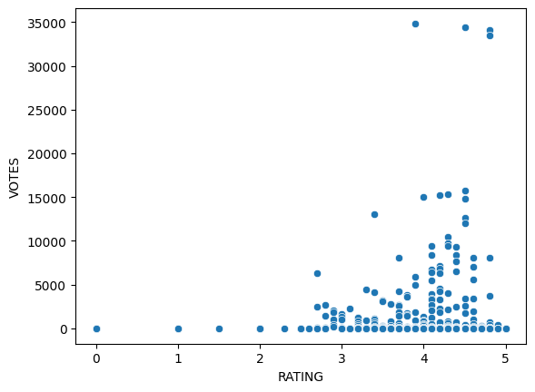
    


**Calculate the correlation between the columns:**


```python
fandango.corr()
```

    /tmp/ipykernel_7687/1316820973.py:1: FutureWarning: The default value of numeric_only in DataFrame.corr is deprecated. In a future version, it will default to False. Select only valid columns or specify the value of numeric_only to silence this warning.
      fandango.corr()


<div>
<style scoped>
    .dataframe tbody tr th:only-of-type {
        vertical-align: middle;
    }

    .dataframe tbody tr th {
        vertical-align: top;
    }

    .dataframe thead th {
        text-align: right;
    }
</style>
<table border="1" class="dataframe">
  <thead>
    <tr style="text-align: right;">
      <th></th>
      <th>STARS</th>
      <th>RATING</th>
      <th>VOTES</th>
    </tr>
  </thead>
  <tbody>
    <tr>
      <th>STARS</th>
      <td>1.000000</td>
      <td>0.994696</td>
      <td>0.164218</td>
    </tr>
    <tr>
      <th>RATING</th>
      <td>0.994696</td>
      <td>1.000000</td>
      <td>0.163764</td>
    </tr>
    <tr>
      <th>VOTES</th>
      <td>0.164218</td>
      <td>0.163764</td>
      <td>1.000000</td>
    </tr>
  </tbody>
</table>
</div>


We see that the correlation between Stars and Rating are not perfect. 0.995 is still very high, however there is some difference between them.

**Assuming that every row in the FILM title column has the same format:**

    Film Title Name (Year)
    
**Create a new column that is able to strip the year from the title strings and set this new column as YEAR**


```python
fandango["YEAR"] = fandango["FILM"].apply(lambda film: film.split(" ")[-1].strip("()"))

fandango
```


<div>
<style scoped>
    .dataframe tbody tr th:only-of-type {
        vertical-align: middle;
    }

    .dataframe tbody tr th {
        vertical-align: top;
    }

    .dataframe thead th {
        text-align: right;
    }
</style>
<table border="1" class="dataframe">
  <thead>
    <tr style="text-align: right;">
      <th></th>
      <th>FILM</th>
      <th>STARS</th>
      <th>RATING</th>
      <th>VOTES</th>
      <th>YEAR</th>
    </tr>
  </thead>
  <tbody>
    <tr>
      <th>0</th>
      <td>Fifty Shades of Grey (2015)</td>
      <td>4.0</td>
      <td>3.9</td>
      <td>34846</td>
      <td>2015</td>
    </tr>
    <tr>
      <th>1</th>
      <td>Jurassic World (2015)</td>
      <td>4.5</td>
      <td>4.5</td>
      <td>34390</td>
      <td>2015</td>
    </tr>
    <tr>
      <th>2</th>
      <td>American Sniper (2015)</td>
      <td>5.0</td>
      <td>4.8</td>
      <td>34085</td>
      <td>2015</td>
    </tr>
    <tr>
      <th>3</th>
      <td>Furious 7 (2015)</td>
      <td>5.0</td>
      <td>4.8</td>
      <td>33538</td>
      <td>2015</td>
    </tr>
    <tr>
      <th>4</th>
      <td>Inside Out (2015)</td>
      <td>4.5</td>
      <td>4.5</td>
      <td>15749</td>
      <td>2015</td>
    </tr>
    <tr>
      <th>...</th>
      <td>...</td>
      <td>...</td>
      <td>...</td>
      <td>...</td>
      <td>...</td>
    </tr>
    <tr>
      <th>499</th>
      <td>Valiyavan (2015)</td>
      <td>0.0</td>
      <td>0.0</td>
      <td>0</td>
      <td>2015</td>
    </tr>
    <tr>
      <th>500</th>
      <td>WWE SummerSlam 2015 (2015)</td>
      <td>0.0</td>
      <td>0.0</td>
      <td>0</td>
      <td>2015</td>
    </tr>
    <tr>
      <th>501</th>
      <td>Yagavarayinum Naa Kaakka (2015)</td>
      <td>0.0</td>
      <td>0.0</td>
      <td>0</td>
      <td>2015</td>
    </tr>
    <tr>
      <th>502</th>
      <td>Yesterday, Today and Tomorrow (1964)</td>
      <td>0.0</td>
      <td>0.0</td>
      <td>0</td>
      <td>1964</td>
    </tr>
    <tr>
      <th>503</th>
      <td>Zarafa (2012)</td>
      <td>0.0</td>
      <td>0.0</td>
      <td>0</td>
      <td>2012</td>
    </tr>
  </tbody>
</table>
<p>504 rows × 5 columns</p>
</div>


**How many movies are in the Fandango DataFrame per year?**


```python
fandango["YEAR"].value_counts()
```


    2015    478
    2014     23
    2016      1
    1964      1
    2012      1
    Name: YEAR, dtype: int64


**Visualize the count of movies per year with a plot:**


```python
sns.countplot(x = fandango["YEAR"])
```


    <AxesSubplot: xlabel='YEAR', ylabel='count'>


    
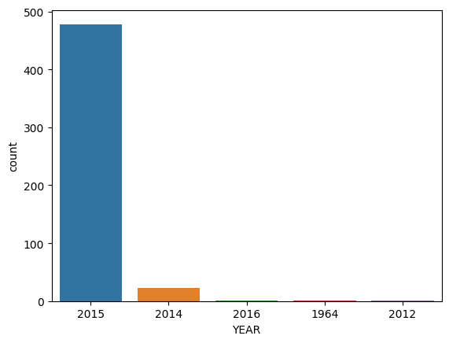
    


**What are the 10 movies with the highest number of votes?**


```python
fandango.nlargest(10,"VOTES")
```


<div>
<style scoped>
    .dataframe tbody tr th:only-of-type {
        vertical-align: middle;
    }

    .dataframe tbody tr th {
        vertical-align: top;
    }

    .dataframe thead th {
        text-align: right;
    }
</style>
<table border="1" class="dataframe">
  <thead>
    <tr style="text-align: right;">
      <th></th>
      <th>FILM</th>
      <th>STARS</th>
      <th>RATING</th>
      <th>VOTES</th>
      <th>YEAR</th>
    </tr>
  </thead>
  <tbody>
    <tr>
      <th>0</th>
      <td>Fifty Shades of Grey (2015)</td>
      <td>4.0</td>
      <td>3.9</td>
      <td>34846</td>
      <td>2015</td>
    </tr>
    <tr>
      <th>1</th>
      <td>Jurassic World (2015)</td>
      <td>4.5</td>
      <td>4.5</td>
      <td>34390</td>
      <td>2015</td>
    </tr>
    <tr>
      <th>2</th>
      <td>American Sniper (2015)</td>
      <td>5.0</td>
      <td>4.8</td>
      <td>34085</td>
      <td>2015</td>
    </tr>
    <tr>
      <th>3</th>
      <td>Furious 7 (2015)</td>
      <td>5.0</td>
      <td>4.8</td>
      <td>33538</td>
      <td>2015</td>
    </tr>
    <tr>
      <th>4</th>
      <td>Inside Out (2015)</td>
      <td>4.5</td>
      <td>4.5</td>
      <td>15749</td>
      <td>2015</td>
    </tr>
    <tr>
      <th>5</th>
      <td>The Hobbit: The Battle of the Five Armies (2014)</td>
      <td>4.5</td>
      <td>4.3</td>
      <td>15337</td>
      <td>2014</td>
    </tr>
    <tr>
      <th>6</th>
      <td>Kingsman: The Secret Service (2015)</td>
      <td>4.5</td>
      <td>4.2</td>
      <td>15205</td>
      <td>2015</td>
    </tr>
    <tr>
      <th>7</th>
      <td>Minions (2015)</td>
      <td>4.0</td>
      <td>4.0</td>
      <td>14998</td>
      <td>2015</td>
    </tr>
    <tr>
      <th>8</th>
      <td>Avengers: Age of Ultron (2015)</td>
      <td>5.0</td>
      <td>4.5</td>
      <td>14846</td>
      <td>2015</td>
    </tr>
    <tr>
      <th>9</th>
      <td>Into the Woods (2014)</td>
      <td>3.5</td>
      <td>3.4</td>
      <td>13055</td>
      <td>2014</td>
    </tr>
  </tbody>
</table>
</div>


Could also use sort values method. It turns out the data is already ordered in this way.

**How many movies have zero votes?**


```python
fandango[fandango["VOTES"]==0]
```


<div>
<style scoped>
    .dataframe tbody tr th:only-of-type {
        vertical-align: middle;
    }

    .dataframe tbody tr th {
        vertical-align: top;
    }

    .dataframe thead th {
        text-align: right;
    }
</style>
<table border="1" class="dataframe">
  <thead>
    <tr style="text-align: right;">
      <th></th>
      <th>FILM</th>
      <th>STARS</th>
      <th>RATING</th>
      <th>VOTES</th>
      <th>YEAR</th>
    </tr>
  </thead>
  <tbody>
    <tr>
      <th>435</th>
      <td>6 Years (2015)</td>
      <td>0.0</td>
      <td>0.0</td>
      <td>0</td>
      <td>2015</td>
    </tr>
    <tr>
      <th>436</th>
      <td>7 Minutes (2015)</td>
      <td>0.0</td>
      <td>0.0</td>
      <td>0</td>
      <td>2015</td>
    </tr>
    <tr>
      <th>437</th>
      <td>A Year in Champagne (2015)</td>
      <td>0.0</td>
      <td>0.0</td>
      <td>0</td>
      <td>2015</td>
    </tr>
    <tr>
      <th>438</th>
      <td>Balls Out (2015)</td>
      <td>0.0</td>
      <td>0.0</td>
      <td>0</td>
      <td>2015</td>
    </tr>
    <tr>
      <th>439</th>
      <td>Before I Wake (2015)</td>
      <td>0.0</td>
      <td>0.0</td>
      <td>0</td>
      <td>2015</td>
    </tr>
    <tr>
      <th>...</th>
      <td>...</td>
      <td>...</td>
      <td>...</td>
      <td>...</td>
      <td>...</td>
    </tr>
    <tr>
      <th>499</th>
      <td>Valiyavan (2015)</td>
      <td>0.0</td>
      <td>0.0</td>
      <td>0</td>
      <td>2015</td>
    </tr>
    <tr>
      <th>500</th>
      <td>WWE SummerSlam 2015 (2015)</td>
      <td>0.0</td>
      <td>0.0</td>
      <td>0</td>
      <td>2015</td>
    </tr>
    <tr>
      <th>501</th>
      <td>Yagavarayinum Naa Kaakka (2015)</td>
      <td>0.0</td>
      <td>0.0</td>
      <td>0</td>
      <td>2015</td>
    </tr>
    <tr>
      <th>502</th>
      <td>Yesterday, Today and Tomorrow (1964)</td>
      <td>0.0</td>
      <td>0.0</td>
      <td>0</td>
      <td>1964</td>
    </tr>
    <tr>
      <th>503</th>
      <td>Zarafa (2012)</td>
      <td>0.0</td>
      <td>0.0</td>
      <td>0</td>
      <td>2012</td>
    </tr>
  </tbody>
</table>
<p>69 rows × 5 columns</p>
</div>


69 Movies have 0 votes.

**Create DataFrame of only reviewed films by removing any films that have zero votes.**


```python
fan_reviewed  = fandango[fandango["VOTES"]>0]
fan_reviewed
```


<div>
<style scoped>
    .dataframe tbody tr th:only-of-type {
        vertical-align: middle;
    }

    .dataframe tbody tr th {
        vertical-align: top;
    }

    .dataframe thead th {
        text-align: right;
    }
</style>
<table border="1" class="dataframe">
  <thead>
    <tr style="text-align: right;">
      <th></th>
      <th>FILM</th>
      <th>STARS</th>
      <th>RATING</th>
      <th>VOTES</th>
      <th>YEAR</th>
    </tr>
  </thead>
  <tbody>
    <tr>
      <th>0</th>
      <td>Fifty Shades of Grey (2015)</td>
      <td>4.0</td>
      <td>3.9</td>
      <td>34846</td>
      <td>2015</td>
    </tr>
    <tr>
      <th>1</th>
      <td>Jurassic World (2015)</td>
      <td>4.5</td>
      <td>4.5</td>
      <td>34390</td>
      <td>2015</td>
    </tr>
    <tr>
      <th>2</th>
      <td>American Sniper (2015)</td>
      <td>5.0</td>
      <td>4.8</td>
      <td>34085</td>
      <td>2015</td>
    </tr>
    <tr>
      <th>3</th>
      <td>Furious 7 (2015)</td>
      <td>5.0</td>
      <td>4.8</td>
      <td>33538</td>
      <td>2015</td>
    </tr>
    <tr>
      <th>4</th>
      <td>Inside Out (2015)</td>
      <td>4.5</td>
      <td>4.5</td>
      <td>15749</td>
      <td>2015</td>
    </tr>
    <tr>
      <th>...</th>
      <td>...</td>
      <td>...</td>
      <td>...</td>
      <td>...</td>
      <td>...</td>
    </tr>
    <tr>
      <th>430</th>
      <td>That Sugar Film (2015)</td>
      <td>5.0</td>
      <td>5.0</td>
      <td>1</td>
      <td>2015</td>
    </tr>
    <tr>
      <th>431</th>
      <td>The Intern (2015)</td>
      <td>5.0</td>
      <td>5.0</td>
      <td>1</td>
      <td>2015</td>
    </tr>
    <tr>
      <th>432</th>
      <td>The Park Bench (2015)</td>
      <td>5.0</td>
      <td>5.0</td>
      <td>1</td>
      <td>2015</td>
    </tr>
    <tr>
      <th>433</th>
      <td>The Wanted 18 (2015)</td>
      <td>5.0</td>
      <td>5.0</td>
      <td>1</td>
      <td>2015</td>
    </tr>
    <tr>
      <th>434</th>
      <td>Z For Zachariah (2015)</td>
      <td>5.0</td>
      <td>5.0</td>
      <td>1</td>
      <td>2015</td>
    </tr>
  </tbody>
</table>
<p>435 rows × 5 columns</p>
</div>


----

**As noted in the article, due to HTML and star rating displays, the true user rating may be slightly different than the rating shown to a user. Let's visualize this difference in distributions.**

**Create a KDE plot (or multiple kdeplots) that displays the distribution of ratings that are displayed (STARS) versus what the true rating was from votes (RATING). Clip the KDEs to 0-5.**


```python
sns.kdeplot(data = fan_reviewed,
           x = "RATING",
           clip = [0,5],
           fill = True,
           label = "True Rating")
sns.kdeplot(data = fan_reviewed,
           x = "STARS",
           clip = [0,5],
           fill = True,
           label = "Stars Displayed")

plt.legend(loc = (1.05,0.5)) # move the legend outside the plot

```


    <matplotlib.legend.Legend at 0x799fbe67ac20>


    
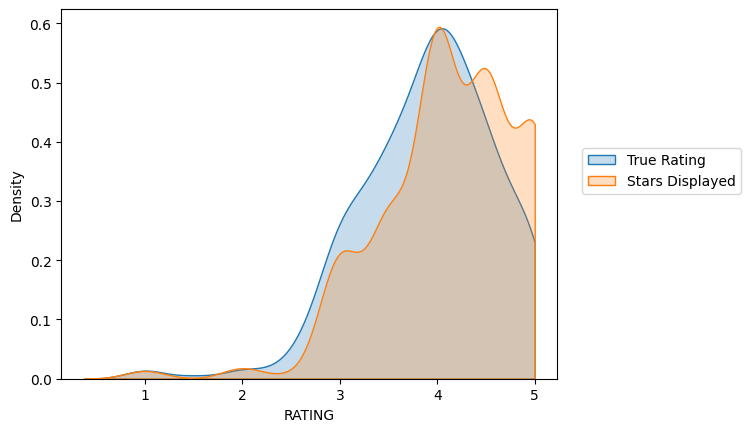
    


**Let's now actually quantify this discrepancy. Create a new column of the different between STARS displayed versus true RATING. Calculate this difference with STARS-RATING and round these differences to the nearest decimal point.**


```python
fan_reviewed["STARS_DIFF"] = fan_reviewed["STARS"] - fan_reviewed["RATING"]
fan_reviewed
```

    /tmp/ipykernel_7687/2685435928.py:1: SettingWithCopyWarning: 
    A value is trying to be set on a copy of a slice from a DataFrame.
    Try using .loc[row_indexer,col_indexer] = value instead
    
    See the caveats in the documentation: https://pandas.pydata.org/pandas-docs/stable/user_guide/indexing.html#returning-a-view-versus-a-copy
      fan_reviewed["STARS_DIFF"] = fan_reviewed["STARS"] - fan_reviewed["RATING"]


<div>
<style scoped>
    .dataframe tbody tr th:only-of-type {
        vertical-align: middle;
    }

    .dataframe tbody tr th {
        vertical-align: top;
    }

    .dataframe thead th {
        text-align: right;
    }
</style>
<table border="1" class="dataframe">
  <thead>
    <tr style="text-align: right;">
      <th></th>
      <th>FILM</th>
      <th>STARS</th>
      <th>RATING</th>
      <th>VOTES</th>
      <th>YEAR</th>
      <th>STARS_DIFF</th>
    </tr>
  </thead>
  <tbody>
    <tr>
      <th>0</th>
      <td>Fifty Shades of Grey (2015)</td>
      <td>4.0</td>
      <td>3.9</td>
      <td>34846</td>
      <td>2015</td>
      <td>0.1</td>
    </tr>
    <tr>
      <th>1</th>
      <td>Jurassic World (2015)</td>
      <td>4.5</td>
      <td>4.5</td>
      <td>34390</td>
      <td>2015</td>
      <td>0.0</td>
    </tr>
    <tr>
      <th>2</th>
      <td>American Sniper (2015)</td>
      <td>5.0</td>
      <td>4.8</td>
      <td>34085</td>
      <td>2015</td>
      <td>0.2</td>
    </tr>
    <tr>
      <th>3</th>
      <td>Furious 7 (2015)</td>
      <td>5.0</td>
      <td>4.8</td>
      <td>33538</td>
      <td>2015</td>
      <td>0.2</td>
    </tr>
    <tr>
      <th>4</th>
      <td>Inside Out (2015)</td>
      <td>4.5</td>
      <td>4.5</td>
      <td>15749</td>
      <td>2015</td>
      <td>0.0</td>
    </tr>
    <tr>
      <th>...</th>
      <td>...</td>
      <td>...</td>
      <td>...</td>
      <td>...</td>
      <td>...</td>
      <td>...</td>
    </tr>
    <tr>
      <th>430</th>
      <td>That Sugar Film (2015)</td>
      <td>5.0</td>
      <td>5.0</td>
      <td>1</td>
      <td>2015</td>
      <td>0.0</td>
    </tr>
    <tr>
      <th>431</th>
      <td>The Intern (2015)</td>
      <td>5.0</td>
      <td>5.0</td>
      <td>1</td>
      <td>2015</td>
      <td>0.0</td>
    </tr>
    <tr>
      <th>432</th>
      <td>The Park Bench (2015)</td>
      <td>5.0</td>
      <td>5.0</td>
      <td>1</td>
      <td>2015</td>
      <td>0.0</td>
    </tr>
    <tr>
      <th>433</th>
      <td>The Wanted 18 (2015)</td>
      <td>5.0</td>
      <td>5.0</td>
      <td>1</td>
      <td>2015</td>
      <td>0.0</td>
    </tr>
    <tr>
      <th>434</th>
      <td>Z For Zachariah (2015)</td>
      <td>5.0</td>
      <td>5.0</td>
      <td>1</td>
      <td>2015</td>
      <td>0.0</td>
    </tr>
  </tbody>
</table>
<p>435 rows × 6 columns</p>
</div>


**Create a count plot to display the number of times a certain difference occurs:**


```python
fan_reviewed["STARS_DIFF"] = fan_reviewed["STARS_DIFF"].round(2)
sns.countplot(data = fan_reviewed, x = "STARS_DIFF", palette="magma")
```

    /tmp/ipykernel_7687/2360758174.py:1: SettingWithCopyWarning: 
    A value is trying to be set on a copy of a slice from a DataFrame.
    Try using .loc[row_indexer,col_indexer] = value instead
    
    See the caveats in the documentation: https://pandas.pydata.org/pandas-docs/stable/user_guide/indexing.html#returning-a-view-versus-a-copy
      fan_reviewed["STARS_DIFF"] = fan_reviewed["STARS_DIFF"].round(2)


    <AxesSubplot: xlabel='STARS_DIFF', ylabel='count'>


    
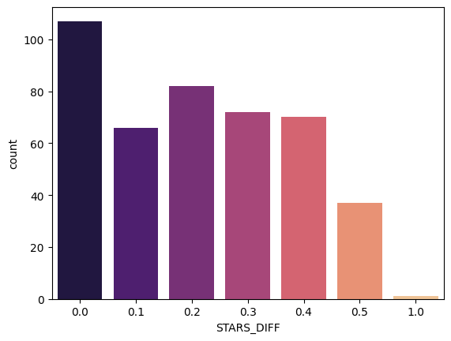
    


This tells us, there are more movies that have been given a higher stars review than true rating. Since the count for the 0 column is just over 100. The count for all the other columns above  0 totals way over 100.

**We can see from the plot that one movie was displaying over a 1 star difference than its true rating! What movie had this close to 1 star differential?**


```python
fan_reviewed[fan_reviewed["STARS_DIFF"]>=1]
```


<div>
<style scoped>
    .dataframe tbody tr th:only-of-type {
        vertical-align: middle;
    }

    .dataframe tbody tr th {
        vertical-align: top;
    }

    .dataframe thead th {
        text-align: right;
    }
</style>
<table border="1" class="dataframe">
  <thead>
    <tr style="text-align: right;">
      <th></th>
      <th>FILM</th>
      <th>STARS</th>
      <th>RATING</th>
      <th>VOTES</th>
      <th>YEAR</th>
      <th>STARS_DIFF</th>
    </tr>
  </thead>
  <tbody>
    <tr>
      <th>381</th>
      <td>Turbo Kid (2015)</td>
      <td>5.0</td>
      <td>4.0</td>
      <td>2</td>
      <td>2015</td>
      <td>1.0</td>
    </tr>
  </tbody>
</table>
</div>


## Part Three: Comparison of Fandango Ratings to Other Sites

Let's now compare the scores from Fandango to other movies sites and see how they compare.

**Read in the "all_sites_scores.csv" file by running the cell below**


```python
all_sites = pd.read_csv("all_sites_scores.csv")
```

**Explore the DataFrame columns, info, description.**


```python
all_sites.head()
```


<div>
<style scoped>
    .dataframe tbody tr th:only-of-type {
        vertical-align: middle;
    }

    .dataframe tbody tr th {
        vertical-align: top;
    }

    .dataframe thead th {
        text-align: right;
    }
</style>
<table border="1" class="dataframe">
  <thead>
    <tr style="text-align: right;">
      <th></th>
      <th>FILM</th>
      <th>RottenTomatoes</th>
      <th>RottenTomatoes_User</th>
      <th>Metacritic</th>
      <th>Metacritic_User</th>
      <th>IMDB</th>
      <th>Metacritic_user_vote_count</th>
      <th>IMDB_user_vote_count</th>
    </tr>
  </thead>
  <tbody>
    <tr>
      <th>0</th>
      <td>Avengers: Age of Ultron (2015)</td>
      <td>74</td>
      <td>86</td>
      <td>66</td>
      <td>7.1</td>
      <td>7.8</td>
      <td>1330</td>
      <td>271107</td>
    </tr>
    <tr>
      <th>1</th>
      <td>Cinderella (2015)</td>
      <td>85</td>
      <td>80</td>
      <td>67</td>
      <td>7.5</td>
      <td>7.1</td>
      <td>249</td>
      <td>65709</td>
    </tr>
    <tr>
      <th>2</th>
      <td>Ant-Man (2015)</td>
      <td>80</td>
      <td>90</td>
      <td>64</td>
      <td>8.1</td>
      <td>7.8</td>
      <td>627</td>
      <td>103660</td>
    </tr>
    <tr>
      <th>3</th>
      <td>Do You Believe? (2015)</td>
      <td>18</td>
      <td>84</td>
      <td>22</td>
      <td>4.7</td>
      <td>5.4</td>
      <td>31</td>
      <td>3136</td>
    </tr>
    <tr>
      <th>4</th>
      <td>Hot Tub Time Machine 2 (2015)</td>
      <td>14</td>
      <td>28</td>
      <td>29</td>
      <td>3.4</td>
      <td>5.1</td>
      <td>88</td>
      <td>19560</td>
    </tr>
  </tbody>
</table>
</div>


```python
all_sites.info()
```

    <class 'pandas.core.frame.DataFrame'>
    RangeIndex: 146 entries, 0 to 145
    Data columns (total 8 columns):
     #   Column                      Non-Null Count  Dtype  
    ---  ------                      --------------  -----  
     0   FILM                        146 non-null    object 
     1   RottenTomatoes              146 non-null    int64  
     2   RottenTomatoes_User         146 non-null    int64  
     3   Metacritic                  146 non-null    int64  
     4   Metacritic_User             146 non-null    float64
     5   IMDB                        146 non-null    float64
     6   Metacritic_user_vote_count  146 non-null    int64  
     7   IMDB_user_vote_count        146 non-null    int64  
    dtypes: float64(2), int64(5), object(1)
    memory usage: 9.2+ KB


```python
all_sites.describe()
```


<div>
<style scoped>
    .dataframe tbody tr th:only-of-type {
        vertical-align: middle;
    }

    .dataframe tbody tr th {
        vertical-align: top;
    }

    .dataframe thead th {
        text-align: right;
    }
</style>
<table border="1" class="dataframe">
  <thead>
    <tr style="text-align: right;">
      <th></th>
      <th>RottenTomatoes</th>
      <th>RottenTomatoes_User</th>
      <th>Metacritic</th>
      <th>Metacritic_User</th>
      <th>IMDB</th>
      <th>Metacritic_user_vote_count</th>
      <th>IMDB_user_vote_count</th>
    </tr>
  </thead>
  <tbody>
    <tr>
      <th>count</th>
      <td>146.000000</td>
      <td>146.000000</td>
      <td>146.000000</td>
      <td>146.000000</td>
      <td>146.000000</td>
      <td>146.000000</td>
      <td>146.000000</td>
    </tr>
    <tr>
      <th>mean</th>
      <td>60.849315</td>
      <td>63.876712</td>
      <td>58.808219</td>
      <td>6.519178</td>
      <td>6.736986</td>
      <td>185.705479</td>
      <td>42846.205479</td>
    </tr>
    <tr>
      <th>std</th>
      <td>30.168799</td>
      <td>20.024430</td>
      <td>19.517389</td>
      <td>1.510712</td>
      <td>0.958736</td>
      <td>316.606515</td>
      <td>67406.509171</td>
    </tr>
    <tr>
      <th>min</th>
      <td>5.000000</td>
      <td>20.000000</td>
      <td>13.000000</td>
      <td>2.400000</td>
      <td>4.000000</td>
      <td>4.000000</td>
      <td>243.000000</td>
    </tr>
    <tr>
      <th>25%</th>
      <td>31.250000</td>
      <td>50.000000</td>
      <td>43.500000</td>
      <td>5.700000</td>
      <td>6.300000</td>
      <td>33.250000</td>
      <td>5627.000000</td>
    </tr>
    <tr>
      <th>50%</th>
      <td>63.500000</td>
      <td>66.500000</td>
      <td>59.000000</td>
      <td>6.850000</td>
      <td>6.900000</td>
      <td>72.500000</td>
      <td>19103.000000</td>
    </tr>
    <tr>
      <th>75%</th>
      <td>89.000000</td>
      <td>81.000000</td>
      <td>75.000000</td>
      <td>7.500000</td>
      <td>7.400000</td>
      <td>168.500000</td>
      <td>45185.750000</td>
    </tr>
    <tr>
      <th>max</th>
      <td>100.000000</td>
      <td>94.000000</td>
      <td>94.000000</td>
      <td>9.600000</td>
      <td>8.600000</td>
      <td>2375.000000</td>
      <td>334164.000000</td>
    </tr>
  </tbody>
</table>
</div>


### Rotten Tomatoes

Let's first take a look at Rotten Tomatoes. RT has two sets of reviews, their critics reviews (ratings published by official critics) and user reviews. 

**Create a scatterplot exploring the relationship between RT Critic reviews and RT User reviews.**


```python
sns.scatterplot(x = "RottenTomatoes", y = "RottenTomatoes_User", data = all_sites)
plt.ylim(0,100)
plt.xlim(0,100)
```


    (0.0, 100.0)


    
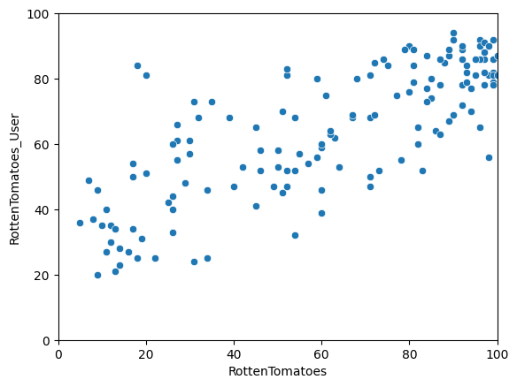
    


We see a positive correlation and it suggets that for the most part, Rotten Tomatoes critics and Rotten Tomatoes users agree. There does exist some outliers towards the top left of the plot.

Let's quantify this difference by comparing the critics ratings and the RT User ratings. We will calculate this with RottenTomatoes-RottenTomatoes_User. Note: Rotten_Diff here is Critics - User Score. So values closer to 0 means aggrement between Critics and Users. Larger positive values means critics rated much higher than users. Larger negative values means users rated much higher than critics.

**Create a new column based off the difference between critics ratings and users ratings for Rotten Tomatoes. Calculate this with RottenTomatoes-RottenTomatoes_User**


```python
all_sites["Rotten_diff"] = all_sites["RottenTomatoes"] - all_sites["RottenTomatoes_User"]
all_sites.head()
```


<div>
<style scoped>
    .dataframe tbody tr th:only-of-type {
        vertical-align: middle;
    }

    .dataframe tbody tr th {
        vertical-align: top;
    }

    .dataframe thead th {
        text-align: right;
    }
</style>
<table border="1" class="dataframe">
  <thead>
    <tr style="text-align: right;">
      <th></th>
      <th>FILM</th>
      <th>RottenTomatoes</th>
      <th>RottenTomatoes_User</th>
      <th>Metacritic</th>
      <th>Metacritic_User</th>
      <th>IMDB</th>
      <th>Metacritic_user_vote_count</th>
      <th>IMDB_user_vote_count</th>
      <th>Rotten_diff</th>
    </tr>
  </thead>
  <tbody>
    <tr>
      <th>0</th>
      <td>Avengers: Age of Ultron (2015)</td>
      <td>74</td>
      <td>86</td>
      <td>66</td>
      <td>7.1</td>
      <td>7.8</td>
      <td>1330</td>
      <td>271107</td>
      <td>-12</td>
    </tr>
    <tr>
      <th>1</th>
      <td>Cinderella (2015)</td>
      <td>85</td>
      <td>80</td>
      <td>67</td>
      <td>7.5</td>
      <td>7.1</td>
      <td>249</td>
      <td>65709</td>
      <td>5</td>
    </tr>
    <tr>
      <th>2</th>
      <td>Ant-Man (2015)</td>
      <td>80</td>
      <td>90</td>
      <td>64</td>
      <td>8.1</td>
      <td>7.8</td>
      <td>627</td>
      <td>103660</td>
      <td>-10</td>
    </tr>
    <tr>
      <th>3</th>
      <td>Do You Believe? (2015)</td>
      <td>18</td>
      <td>84</td>
      <td>22</td>
      <td>4.7</td>
      <td>5.4</td>
      <td>31</td>
      <td>3136</td>
      <td>-66</td>
    </tr>
    <tr>
      <th>4</th>
      <td>Hot Tub Time Machine 2 (2015)</td>
      <td>14</td>
      <td>28</td>
      <td>29</td>
      <td>3.4</td>
      <td>5.1</td>
      <td>88</td>
      <td>19560</td>
      <td>-14</td>
    </tr>
  </tbody>
</table>
</div>


Let's now compare the overall mean difference. Since we're dealing with differences that could be negative or positive, first take the absolute value of all the differences, then take the mean. This would report back on average to absolute difference between the critics rating versus the user rating.

**Calculate the Mean Absolute Difference between RT scores and RT User scores as described above.**


```python
# Average of the abs value.
all_sites["Rotten_diff"].apply(abs).mean()
```


    15.095890410958905


This score could be average in any direction. Positive or negative, since its the average of the abs value. 

We see that there is on average a difference of around 15%.

**Plot the distribution of the differences between RT Critics Score and RT User Score. There should be negative values in this distribution plot. Feel free to use KDE or Histograms to display this distribution.**


```python
sns.histplot(all_sites["Rotten_diff"], kde = True, bins = 25)
plt.title("RT Critis - Rt User Score")
```


    Text(0.5, 1.0, 'RT Critis - Rt User Score')


    
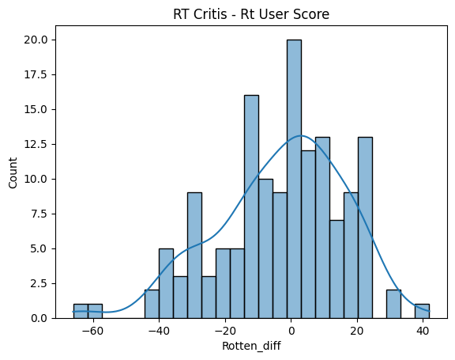
    


0 is where critics and users agree. For the most part, it looks like they agree however there are some extreme instances at both tails.

**Now create a distribution showing the *absolute value* difference between Critics and Users on Rotten Tomatoes.**


```python
sns.histplot(all_sites["Rotten_diff"].apply(abs), kde = True, bins = 25)
plt.title("abs(RT Critis - Rt User Score)")
```


    Text(0.5, 1.0, 'abs(RT Critis - Rt User Score)')


    
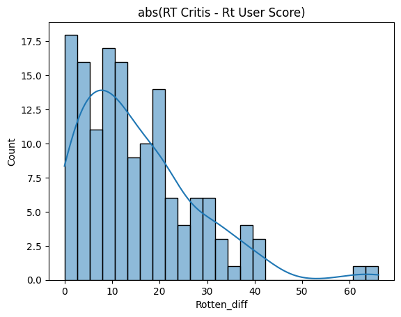
    


**Let's find out which movies are causing the largest differences. First, show the top 5 movies with the largest *negative* difference between Users and RT critics. Since we calculated the difference as Critics Rating - Users Rating, then large negative values imply the users rated the movie much higher on average than the critics did.**

**What are the top 5 movies users rated higher than critics on average:**


```python
all_sites.nsmallest(5,"Rotten_diff")["FILM"]
```


    3         Do You Believe? (2015)
    85             Little Boy (2015)
    105      Hitman: Agent 47 (2015)
    134      The Longest Ride (2015)
    125    The Wedding Ringer (2015)
    Name: FILM, dtype: object


**Now show the top 5 movies critics scores higher than users on average.**


```python
all_sites.nlargest(5,"Rotten_diff")["FILM"]
```


    69                    Mr. Turner (2014)
    112                   It Follows (2015)
    115            While We're Young (2015)
    37                 Welcome to Me (2015)
    40     I'll See You In My Dreams (2015)
    Name: FILM, dtype: object


## MetaCritic

Now let's take a quick look at the ratings from MetaCritic. Metacritic also shows an average user rating versus their official displayed rating.

**Display a scatterplot of the Metacritic Rating versus the Metacritic User rating.**


```python
sns.scatterplot(x = "Metacritic", y = "Metacritic_User", data = all_sites)
plt.ylim(0,10)
plt.xlim(0,100)
```


    (0.0, 100.0)


    
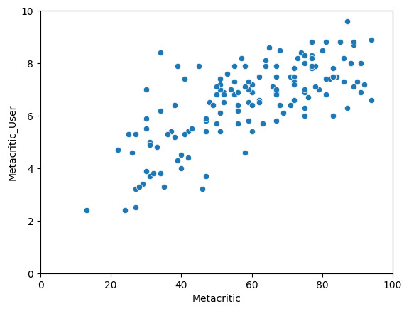
    


## IMDB

Finally let's explore IMDB. Notice that both Metacritic and IMDB report back vote counts. Let's analyze the most popular movies.

**Create a scatterplot for the relationship between vote counts on MetaCritic versus vote counts on IMDB.**


```python
sns.scatterplot(x = "Metacritic_user_vote_count", y = "IMDB_user_vote_count", data = all_sites)
plt.title("Movie vote counts on different platforms")
```


    Text(0.5, 1.0, 'Movie vote counts on different platforms')


    
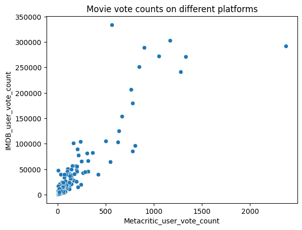
    


**Notice there are two outliers here. The movie with the highest vote count on IMDB only has about 500 Metacritic ratings. What is this movie?**

**What movie has the highest IMDB user vote count?**


```python
all_sites.nlargest(3,"IMDB_user_vote_count")[["FILM", "IMDB_user_vote_count"]]
```


<div>
<style scoped>
    .dataframe tbody tr th:only-of-type {
        vertical-align: middle;
    }

    .dataframe tbody tr th {
        vertical-align: top;
    }

    .dataframe thead th {
        text-align: right;
    }
</style>
<table border="1" class="dataframe">
  <thead>
    <tr style="text-align: right;">
      <th></th>
      <th>FILM</th>
      <th>IMDB_user_vote_count</th>
    </tr>
  </thead>
  <tbody>
    <tr>
      <th>14</th>
      <td>The Imitation Game (2014)</td>
      <td>334164</td>
    </tr>
    <tr>
      <th>65</th>
      <td>Birdman (2014)</td>
      <td>303505</td>
    </tr>
    <tr>
      <th>88</th>
      <td>Mad Max: Fury Road (2015)</td>
      <td>292023</td>
    </tr>
  </tbody>
</table>
</div>


**What movie has the highest Metacritic User Vote count?**


```python
all_sites.nlargest(3,"Metacritic_user_vote_count")[["FILM", "Metacritic_user_vote_count"]]
```


<div>
<style scoped>
    .dataframe tbody tr th:only-of-type {
        vertical-align: middle;
    }

    .dataframe tbody tr th {
        vertical-align: top;
    }

    .dataframe thead th {
        text-align: right;
    }
</style>
<table border="1" class="dataframe">
  <thead>
    <tr style="text-align: right;">
      <th></th>
      <th>FILM</th>
      <th>Metacritic_user_vote_count</th>
    </tr>
  </thead>
  <tbody>
    <tr>
      <th>88</th>
      <td>Mad Max: Fury Road (2015)</td>
      <td>2375</td>
    </tr>
    <tr>
      <th>0</th>
      <td>Avengers: Age of Ultron (2015)</td>
      <td>1330</td>
    </tr>
    <tr>
      <th>130</th>
      <td>Jurassic World (2015)</td>
      <td>1281</td>
    </tr>
  </tbody>
</table>
</div>


## Fandago Scores vs. All Sites

Finally let's begin to explore whether or not Fandango artificially displays higher ratings than warranted to boost ticket sales.

**Combine the Fandango Table with the All Sites table. Not every movie in the Fandango table is in the All Sites table, since some Fandango movies have very little or no reviews. We only want to compare movies that are in both DataFrames, so do an *inner* merge to merge together both DataFrames based on the FILM columns.**


```python
df = pd.merge(fandango, all_sites, on = "FILM", how = "inner") # merge only the movies that are present in both dataframes

# assumption: the formate of the firlm names are the same. FILM NAME (YEAR)

df.head()
```


<div>
<style scoped>
    .dataframe tbody tr th:only-of-type {
        vertical-align: middle;
    }

    .dataframe tbody tr th {
        vertical-align: top;
    }

    .dataframe thead th {
        text-align: right;
    }
</style>
<table border="1" class="dataframe">
  <thead>
    <tr style="text-align: right;">
      <th></th>
      <th>FILM</th>
      <th>STARS</th>
      <th>RATING</th>
      <th>VOTES</th>
      <th>YEAR</th>
      <th>RottenTomatoes</th>
      <th>RottenTomatoes_User</th>
      <th>Metacritic</th>
      <th>Metacritic_User</th>
      <th>IMDB</th>
      <th>Metacritic_user_vote_count</th>
      <th>IMDB_user_vote_count</th>
      <th>Rotten_diff</th>
    </tr>
  </thead>
  <tbody>
    <tr>
      <th>0</th>
      <td>Fifty Shades of Grey (2015)</td>
      <td>4.0</td>
      <td>3.9</td>
      <td>34846</td>
      <td>2015</td>
      <td>25</td>
      <td>42</td>
      <td>46</td>
      <td>3.2</td>
      <td>4.2</td>
      <td>778</td>
      <td>179506</td>
      <td>-17</td>
    </tr>
    <tr>
      <th>1</th>
      <td>Jurassic World (2015)</td>
      <td>4.5</td>
      <td>4.5</td>
      <td>34390</td>
      <td>2015</td>
      <td>71</td>
      <td>81</td>
      <td>59</td>
      <td>7.0</td>
      <td>7.3</td>
      <td>1281</td>
      <td>241807</td>
      <td>-10</td>
    </tr>
    <tr>
      <th>2</th>
      <td>American Sniper (2015)</td>
      <td>5.0</td>
      <td>4.8</td>
      <td>34085</td>
      <td>2015</td>
      <td>72</td>
      <td>85</td>
      <td>72</td>
      <td>6.6</td>
      <td>7.4</td>
      <td>850</td>
      <td>251856</td>
      <td>-13</td>
    </tr>
    <tr>
      <th>3</th>
      <td>Furious 7 (2015)</td>
      <td>5.0</td>
      <td>4.8</td>
      <td>33538</td>
      <td>2015</td>
      <td>81</td>
      <td>84</td>
      <td>67</td>
      <td>6.8</td>
      <td>7.4</td>
      <td>764</td>
      <td>207211</td>
      <td>-3</td>
    </tr>
    <tr>
      <th>4</th>
      <td>Inside Out (2015)</td>
      <td>4.5</td>
      <td>4.5</td>
      <td>15749</td>
      <td>2015</td>
      <td>98</td>
      <td>90</td>
      <td>94</td>
      <td>8.9</td>
      <td>8.6</td>
      <td>807</td>
      <td>96252</td>
      <td>8</td>
    </tr>
  </tbody>
</table>
</div>


```python
df.info()
```

    <class 'pandas.core.frame.DataFrame'>
    Int64Index: 145 entries, 0 to 144
    Data columns (total 13 columns):
     #   Column                      Non-Null Count  Dtype  
    ---  ------                      --------------  -----  
     0   FILM                        145 non-null    object 
     1   STARS                       145 non-null    float64
     2   RATING                      145 non-null    float64
     3   VOTES                       145 non-null    int64  
     4   YEAR                        145 non-null    object 
     5   RottenTomatoes              145 non-null    int64  
     6   RottenTomatoes_User         145 non-null    int64  
     7   Metacritic                  145 non-null    int64  
     8   Metacritic_User             145 non-null    float64
     9   IMDB                        145 non-null    float64
     10  Metacritic_user_vote_count  145 non-null    int64  
     11  IMDB_user_vote_count        145 non-null    int64  
     12  Rotten_diff                 145 non-null    int64  
    dtypes: float64(4), int64(7), object(2)
    memory usage: 15.9+ KB


### Normalize columns to Fandango STARS and RATINGS 0-5 

Notice that RT,Metacritic, and IMDB don't use a score between 0-5 stars like Fandango does. In order to do a fair comparison, we need to *normalize* these values so they all fall between 0-5 stars and the relationship between reviews stays the same.

**Create new normalized columns for all ratings so they match up within the 0-5 star range shown on Fandango. There are many ways to do this.**

Hint link: https://stackoverflow.com/questions/26414913/normalize-columns-of-pandas-data-frame


Easier Hint:

Keep in mind, a simple way to convert ratings:
* 100/20 = 5 
* 10/2 = 5


```python
df.describe().transpose()["max"]
```


    STARS                              5.0
    RATING                             4.8
    VOTES                          34846.0
    RottenTomatoes                   100.0
    RottenTomatoes_User               94.0
    Metacritic                        94.0
    Metacritic_User                    9.6
    IMDB                               8.6
    Metacritic_user_vote_count      2375.0
    IMDB_user_vote_count          334164.0
    Rotten_diff                       42.0
    Name: max, dtype: float64


```python
import numpy as np
```


```python
df["Rt_Norm"] = np.round(df["RottenTomatoes"]/20,1)
df["RtU_Norm"] = np.round(df["RottenTomatoes_User"]/20,1)
```


```python
df["Meta_Norm"] = np.round(df["Metacritic"]/20,1)
df["MetaU_Norm"] = np.round(df["Metacritic_User"]/2,1)
```


```python
df["IMDB_Norm"] = np.round(df["IMDB"]/2,1)
#df["Rt_Norm"] = np.round(df[]/20,1)
```


```python
df.head()
```


<div>
<style scoped>
    .dataframe tbody tr th:only-of-type {
        vertical-align: middle;
    }

    .dataframe tbody tr th {
        vertical-align: top;
    }

    .dataframe thead th {
        text-align: right;
    }
</style>
<table border="1" class="dataframe">
  <thead>
    <tr style="text-align: right;">
      <th></th>
      <th>FILM</th>
      <th>STARS</th>
      <th>RATING</th>
      <th>VOTES</th>
      <th>YEAR</th>
      <th>RottenTomatoes</th>
      <th>RottenTomatoes_User</th>
      <th>Metacritic</th>
      <th>Metacritic_User</th>
      <th>IMDB</th>
      <th>Metacritic_user_vote_count</th>
      <th>IMDB_user_vote_count</th>
      <th>Rotten_diff</th>
      <th>Rt_Norm</th>
      <th>RtU_Norm</th>
      <th>Meta_Norm</th>
      <th>MetaU_Norm</th>
      <th>IMDB_Norm</th>
    </tr>
  </thead>
  <tbody>
    <tr>
      <th>0</th>
      <td>Fifty Shades of Grey (2015)</td>
      <td>4.0</td>
      <td>3.9</td>
      <td>34846</td>
      <td>2015</td>
      <td>25</td>
      <td>42</td>
      <td>46</td>
      <td>3.2</td>
      <td>4.2</td>
      <td>778</td>
      <td>179506</td>
      <td>-17</td>
      <td>1.2</td>
      <td>2.1</td>
      <td>2.3</td>
      <td>1.6</td>
      <td>2.1</td>
    </tr>
    <tr>
      <th>1</th>
      <td>Jurassic World (2015)</td>
      <td>4.5</td>
      <td>4.5</td>
      <td>34390</td>
      <td>2015</td>
      <td>71</td>
      <td>81</td>
      <td>59</td>
      <td>7.0</td>
      <td>7.3</td>
      <td>1281</td>
      <td>241807</td>
      <td>-10</td>
      <td>3.6</td>
      <td>4.0</td>
      <td>3.0</td>
      <td>3.5</td>
      <td>3.6</td>
    </tr>
    <tr>
      <th>2</th>
      <td>American Sniper (2015)</td>
      <td>5.0</td>
      <td>4.8</td>
      <td>34085</td>
      <td>2015</td>
      <td>72</td>
      <td>85</td>
      <td>72</td>
      <td>6.6</td>
      <td>7.4</td>
      <td>850</td>
      <td>251856</td>
      <td>-13</td>
      <td>3.6</td>
      <td>4.2</td>
      <td>3.6</td>
      <td>3.3</td>
      <td>3.7</td>
    </tr>
    <tr>
      <th>3</th>
      <td>Furious 7 (2015)</td>
      <td>5.0</td>
      <td>4.8</td>
      <td>33538</td>
      <td>2015</td>
      <td>81</td>
      <td>84</td>
      <td>67</td>
      <td>6.8</td>
      <td>7.4</td>
      <td>764</td>
      <td>207211</td>
      <td>-3</td>
      <td>4.0</td>
      <td>4.2</td>
      <td>3.4</td>
      <td>3.4</td>
      <td>3.7</td>
    </tr>
    <tr>
      <th>4</th>
      <td>Inside Out (2015)</td>
      <td>4.5</td>
      <td>4.5</td>
      <td>15749</td>
      <td>2015</td>
      <td>98</td>
      <td>90</td>
      <td>94</td>
      <td>8.9</td>
      <td>8.6</td>
      <td>807</td>
      <td>96252</td>
      <td>8</td>
      <td>4.9</td>
      <td>4.5</td>
      <td>4.7</td>
      <td>4.4</td>
      <td>4.3</td>
    </tr>
  </tbody>
</table>
</div>


```python

```

**Now create a norm_scores DataFrame that only contains the normalizes ratings. Include both STARS and RATING from the original Fandango table.**


```python
df.columns
```


    Index(['FILM', 'STARS', 'RATING', 'VOTES', 'YEAR', 'RottenTomatoes',
           'RottenTomatoes_User', 'Metacritic', 'Metacritic_User', 'IMDB',
           'Metacritic_user_vote_count', 'IMDB_user_vote_count', 'Rotten_diff',
           'Rt_Norm', 'RtU_Norm', 'Meta_Norm', 'MetaU_Norm', 'IMDB_Norm'],
          dtype='object')


```python
norm_scores = df[["STARS", "RATING", 'Rt_Norm', 'RtU_Norm', 'Meta_Norm', 'MetaU_Norm', 'IMDB_Norm']]
norm_scores.head()
```


<div>
<style scoped>
    .dataframe tbody tr th:only-of-type {
        vertical-align: middle;
    }

    .dataframe tbody tr th {
        vertical-align: top;
    }

    .dataframe thead th {
        text-align: right;
    }
</style>
<table border="1" class="dataframe">
  <thead>
    <tr style="text-align: right;">
      <th></th>
      <th>STARS</th>
      <th>RATING</th>
      <th>Rt_Norm</th>
      <th>RtU_Norm</th>
      <th>Meta_Norm</th>
      <th>MetaU_Norm</th>
      <th>IMDB_Norm</th>
    </tr>
  </thead>
  <tbody>
    <tr>
      <th>0</th>
      <td>4.0</td>
      <td>3.9</td>
      <td>1.2</td>
      <td>2.1</td>
      <td>2.3</td>
      <td>1.6</td>
      <td>2.1</td>
    </tr>
    <tr>
      <th>1</th>
      <td>4.5</td>
      <td>4.5</td>
      <td>3.6</td>
      <td>4.0</td>
      <td>3.0</td>
      <td>3.5</td>
      <td>3.6</td>
    </tr>
    <tr>
      <th>2</th>
      <td>5.0</td>
      <td>4.8</td>
      <td>3.6</td>
      <td>4.2</td>
      <td>3.6</td>
      <td>3.3</td>
      <td>3.7</td>
    </tr>
    <tr>
      <th>3</th>
      <td>5.0</td>
      <td>4.8</td>
      <td>4.0</td>
      <td>4.2</td>
      <td>3.4</td>
      <td>3.4</td>
      <td>3.7</td>
    </tr>
    <tr>
      <th>4</th>
      <td>4.5</td>
      <td>4.5</td>
      <td>4.9</td>
      <td>4.5</td>
      <td>4.7</td>
      <td>4.4</td>
      <td>4.3</td>
    </tr>
  </tbody>
</table>
</div>


### Comparing Distribution of Scores Across Sites


Now the moment of truth! Does Fandango display abnormally high ratings? We already know it pushs displayed RATING higher than STARS, but are the ratings themselves higher than average?


```python
plt.figure(figsize=(10,5))
ax = sns.kdeplot(data= norm_scores,
           fill = True,
           clip = [0,5])

sns.move_legend(ax, "upper left", bbox_to_anchor=(1, 1))


```


    
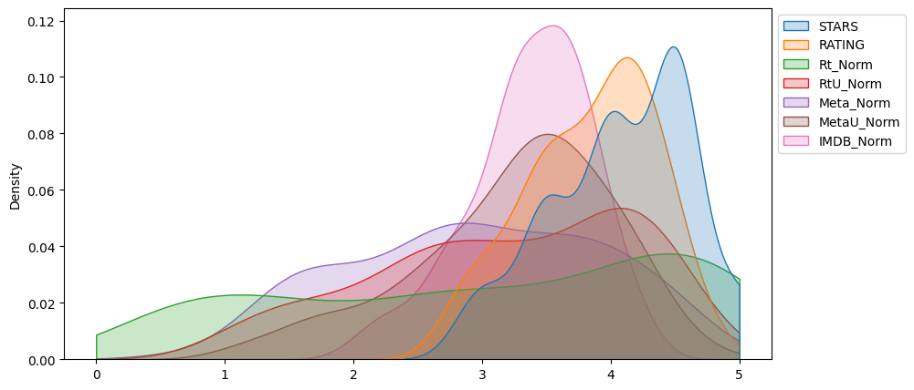
    


**Clearly Fandango has an uneven distribution. We can also see that RT critics have the most uniform distribution. Let's directly compare these two.** 

**KDE plot that compare the distribution of RT critic ratings against the STARS displayed by Fandango.**


```python
plt.figure(figsize=(10,5))
ax = sns.kdeplot(data= norm_scores[["Rt_Norm", "STARS"]],
           fill = True,
           clip = [0,5])

sns.move_legend(ax, "upper left", bbox_to_anchor=(1, 1))


```


    
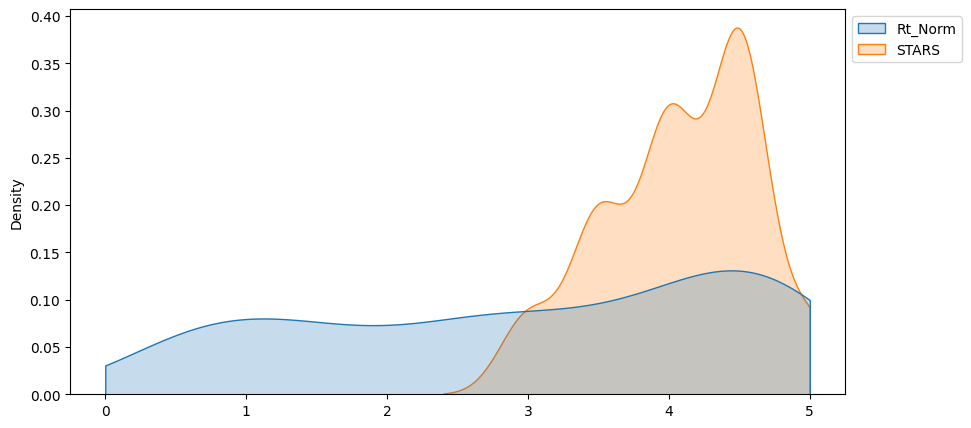
    


RT critics, the movie ratings are more or less uniformly distributed. They dont over or under rate. We see that the Fandingos movies ratings, the stars are all high. Almost as if Fandingo does not rate movies badly.

**Create a histplot comparing all normalized scores.**


```python
plt.figure(figsize=(10,5))
sns.histplot(norm_scores, bins = 25)
```


    <AxesSubplot: ylabel='Count'>


    
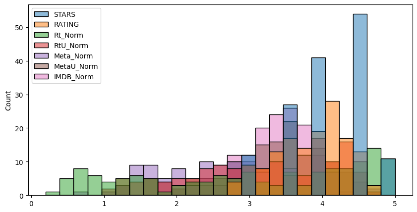
    


All of these are ratings for the same movies. Ideally you would expect all to be a simular distribution. Fandingo always seems to be higher.


### How are the worst movies rated across all platforms?

**Create a clustermap visualization of all normalized scores. Note the differences in ratings, highly rated movies should be clustered together versus poorly rated movies. Note: This clustermap does not need to have the FILM titles as the index, feel free to drop it for the clustermap.**


```python
sns.clustermap(norm_scores, cmap = "magma", col_cluster=False)
```


    <seaborn.matrix.ClusterGrid at 0x799fb9645db0>


    
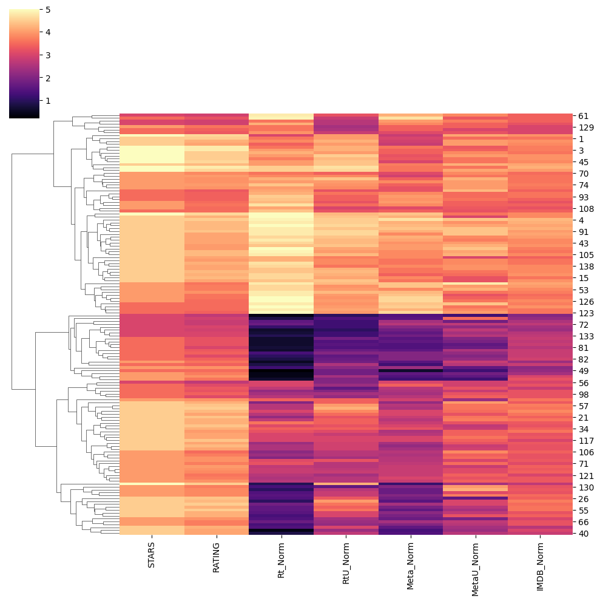
    


Clustering movie ratings based of all sights. We see that Rotten Tomatos criticts seem to be the harshest. In general though, there is an agreement with other movie criticts on what movies are low ratings and what are high. Expect when you look at the ratings on Fandingos sights. They almost dont rate any movie bad. They seem to be pushing up the ratings for these movies.

**Clearly Fandango is rating movies much higher than other sites, especially considering that it is then displaying a rounded up version of the rating. Let's examine the top 10 worst movies. Based off the Rotten Tomatoes Critic Ratings, what are the top 10 lowest rated movies? What are the normalized scores across all platforms for these movies? You may need to add the FILM column back in to your DataFrame of normalized scores to see the results.**


```python
norm_scores.columns
```


    Index(['STARS', 'RATING', 'Rt_Norm', 'RtU_Norm', 'Meta_Norm', 'MetaU_Norm',
           'IMDB_Norm'],
          dtype='object')


```python
norm_films = df[['FILM','STARS', 'RATING', 'Rt_Norm', 'RtU_Norm', 'Meta_Norm', 'MetaU_Norm',
       'IMDB_Norm']]

norm_films.head()
```


<div>
<style scoped>
    .dataframe tbody tr th:only-of-type {
        vertical-align: middle;
    }

    .dataframe tbody tr th {
        vertical-align: top;
    }

    .dataframe thead th {
        text-align: right;
    }
</style>
<table border="1" class="dataframe">
  <thead>
    <tr style="text-align: right;">
      <th></th>
      <th>FILM</th>
      <th>STARS</th>
      <th>RATING</th>
      <th>Rt_Norm</th>
      <th>RtU_Norm</th>
      <th>Meta_Norm</th>
      <th>MetaU_Norm</th>
      <th>IMDB_Norm</th>
    </tr>
  </thead>
  <tbody>
    <tr>
      <th>0</th>
      <td>Fifty Shades of Grey (2015)</td>
      <td>4.0</td>
      <td>3.9</td>
      <td>1.2</td>
      <td>2.1</td>
      <td>2.3</td>
      <td>1.6</td>
      <td>2.1</td>
    </tr>
    <tr>
      <th>1</th>
      <td>Jurassic World (2015)</td>
      <td>4.5</td>
      <td>4.5</td>
      <td>3.6</td>
      <td>4.0</td>
      <td>3.0</td>
      <td>3.5</td>
      <td>3.6</td>
    </tr>
    <tr>
      <th>2</th>
      <td>American Sniper (2015)</td>
      <td>5.0</td>
      <td>4.8</td>
      <td>3.6</td>
      <td>4.2</td>
      <td>3.6</td>
      <td>3.3</td>
      <td>3.7</td>
    </tr>
    <tr>
      <th>3</th>
      <td>Furious 7 (2015)</td>
      <td>5.0</td>
      <td>4.8</td>
      <td>4.0</td>
      <td>4.2</td>
      <td>3.4</td>
      <td>3.4</td>
      <td>3.7</td>
    </tr>
    <tr>
      <th>4</th>
      <td>Inside Out (2015)</td>
      <td>4.5</td>
      <td>4.5</td>
      <td>4.9</td>
      <td>4.5</td>
      <td>4.7</td>
      <td>4.4</td>
      <td>4.3</td>
    </tr>
  </tbody>
</table>
</div>


```python
worst_films = norm_films.nsmallest(10,"Rt_Norm")
worst_films
```


<div>
<style scoped>
    .dataframe tbody tr th:only-of-type {
        vertical-align: middle;
    }

    .dataframe tbody tr th {
        vertical-align: top;
    }

    .dataframe thead th {
        text-align: right;
    }
</style>
<table border="1" class="dataframe">
  <thead>
    <tr style="text-align: right;">
      <th></th>
      <th>FILM</th>
      <th>STARS</th>
      <th>RATING</th>
      <th>Rt_Norm</th>
      <th>RtU_Norm</th>
      <th>Meta_Norm</th>
      <th>MetaU_Norm</th>
      <th>IMDB_Norm</th>
    </tr>
  </thead>
  <tbody>
    <tr>
      <th>49</th>
      <td>Paul Blart: Mall Cop 2 (2015)</td>
      <td>3.5</td>
      <td>3.5</td>
      <td>0.2</td>
      <td>1.8</td>
      <td>0.6</td>
      <td>1.2</td>
      <td>2.2</td>
    </tr>
    <tr>
      <th>25</th>
      <td>Taken 3 (2015)</td>
      <td>4.5</td>
      <td>4.1</td>
      <td>0.4</td>
      <td>2.3</td>
      <td>1.3</td>
      <td>2.3</td>
      <td>3.0</td>
    </tr>
    <tr>
      <th>28</th>
      <td>Fantastic Four (2015)</td>
      <td>3.0</td>
      <td>2.7</td>
      <td>0.4</td>
      <td>1.0</td>
      <td>1.4</td>
      <td>1.2</td>
      <td>2.0</td>
    </tr>
    <tr>
      <th>54</th>
      <td>Hot Pursuit (2015)</td>
      <td>4.0</td>
      <td>3.7</td>
      <td>0.4</td>
      <td>1.8</td>
      <td>1.6</td>
      <td>1.8</td>
      <td>2.4</td>
    </tr>
    <tr>
      <th>84</th>
      <td>Hitman: Agent 47 (2015)</td>
      <td>4.0</td>
      <td>3.9</td>
      <td>0.4</td>
      <td>2.4</td>
      <td>1.4</td>
      <td>1.6</td>
      <td>3.0</td>
    </tr>
    <tr>
      <th>50</th>
      <td>The Boy Next Door (2015)</td>
      <td>4.0</td>
      <td>3.6</td>
      <td>0.5</td>
      <td>1.8</td>
      <td>1.5</td>
      <td>2.8</td>
      <td>2.3</td>
    </tr>
    <tr>
      <th>77</th>
      <td>Seventh Son (2015)</td>
      <td>3.5</td>
      <td>3.2</td>
      <td>0.6</td>
      <td>1.8</td>
      <td>1.5</td>
      <td>2.0</td>
      <td>2.8</td>
    </tr>
    <tr>
      <th>78</th>
      <td>Mortdecai (2015)</td>
      <td>3.5</td>
      <td>3.2</td>
      <td>0.6</td>
      <td>1.5</td>
      <td>1.4</td>
      <td>1.6</td>
      <td>2.8</td>
    </tr>
    <tr>
      <th>83</th>
      <td>Sinister 2 (2015)</td>
      <td>3.5</td>
      <td>3.3</td>
      <td>0.6</td>
      <td>1.7</td>
      <td>1.6</td>
      <td>2.5</td>
      <td>2.8</td>
    </tr>
    <tr>
      <th>87</th>
      <td>Unfinished Business (2015)</td>
      <td>3.5</td>
      <td>3.2</td>
      <td>0.6</td>
      <td>1.4</td>
      <td>1.6</td>
      <td>1.9</td>
      <td>2.7</td>
    </tr>
  </tbody>
</table>
</div>


The ten worst films according to the Rottontamato critics.

**Visualize the distribution of ratings across all sites for the top 10 worst movies.**


```python
plt.figure(figsize=(10,5))
ax = sns.kdeplot(data= worst_films,
           fill = True,
           clip = [0,5])

sns.move_legend(ax, "upper left", bbox_to_anchor=(1, 1))
```


    
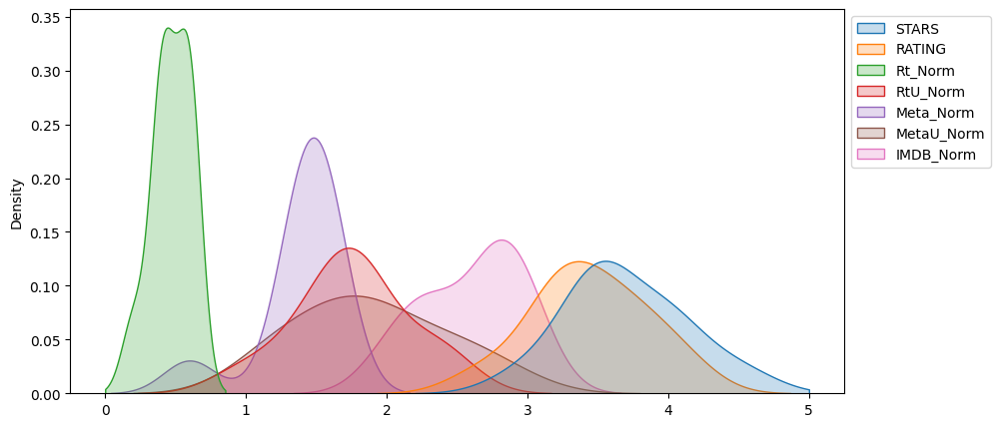
    


This is the distribution of scores for the 10 worst movies according to Rottentomatos. We see that the distribution for RT is centered around 0.5. We know that they are the harshest critics. Even the distributions from other critic sites are still low. However Fandingos ratings for the worst movies is centered around 3.5 to 4. Which is really high compared to everything else.

---
----


**Final thoughts: Wow! Fandango is showing around 3-4 star ratings for films that are clearly bad! Notice the biggest offender, [Taken 3!](https://www.youtube.com/watch?v=tJrfImRCHJ0). Fandango is displaying 4.5 stars on their site for a film with an [average rating of 1.86](https://en.wikipedia.org/wiki/Taken_3#Critical_response) across the other platforms!**


```python
worst_films[worst_films["FILM"] == "Taken 3 (2015)"].transpose()[1:]
```


<div>
<style scoped>
    .dataframe tbody tr th:only-of-type {
        vertical-align: middle;
    }

    .dataframe tbody tr th {
        vertical-align: top;
    }

    .dataframe thead th {
        text-align: right;
    }
</style>
<table border="1" class="dataframe">
  <thead>
    <tr style="text-align: right;">
      <th></th>
      <th>25</th>
    </tr>
  </thead>
  <tbody>
    <tr>
      <th>STARS</th>
      <td>4.5</td>
    </tr>
    <tr>
      <th>RATING</th>
      <td>4.1</td>
    </tr>
    <tr>
      <th>Rt_Norm</th>
      <td>0.4</td>
    </tr>
    <tr>
      <th>RtU_Norm</th>
      <td>2.3</td>
    </tr>
    <tr>
      <th>Meta_Norm</th>
      <td>1.3</td>
    </tr>
    <tr>
      <th>MetaU_Norm</th>
      <td>2.3</td>
    </tr>
    <tr>
      <th>IMDB_Norm</th>
      <td>3.0</td>
    </tr>
  </tbody>
</table>
</div>


**What I learnted from this project**
- Learnt to manipulate data frames, for example, combining two separate data frames and combining them into one. 
- Normalising scores and comparing scores that are different scales to each other.
- More data visualisation techniques. Such as KDE plots.
- I learned how to start with an exciting question and break the problem down to find an answer.

----
